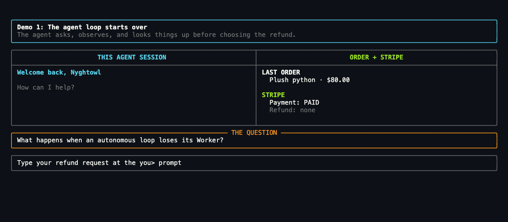
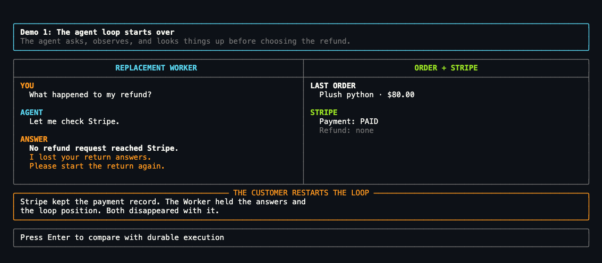
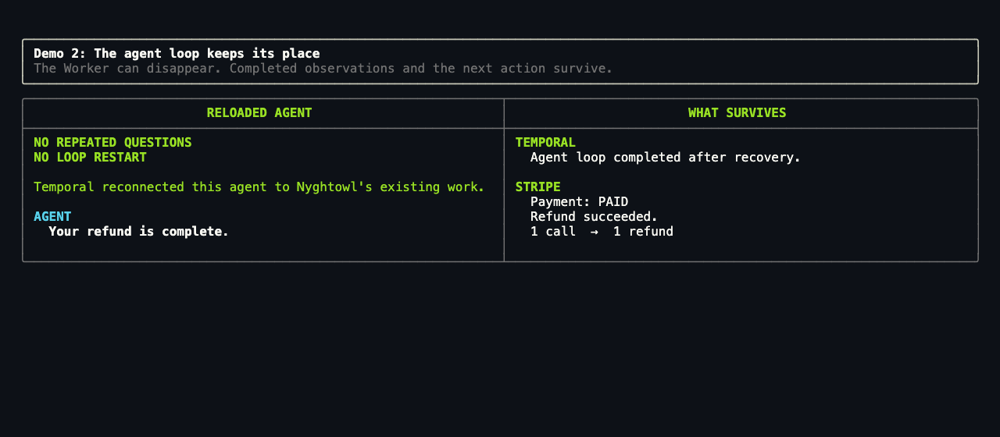

# Agent Memory and State

<div align="center">

[](LICENSE)
[](pyproject.toml)
[](https://github.com/temporalio/sdk-python)
[](https://docs.stripe.com/test-mode)
[](https://docs.astral.sh/uv/)

</div>

**A visual Python demo showing how an agent can know what to do and still lose
the customer's in-flight work.**

The same autonomous refund loop runs twice. The agent asks Nyghtowl questions,
observes the answers, looks up the order and refund history, and chooses its next
action. The naive Worker disappears before calling Stripe, so its loop position
is lost. The durable agent reconnects to the existing Temporal Workflow and
resumes at `issue refund` without repeating questions or restarting the loop.

There is no agent framework. The point is to make the boundary between context,
memory, and authoritative state visible.

## See the idea in 15 seconds



[Watch or download the MP4 version](assets/demo-reel.mp4).

| Moment | Naive agent | Durable agent |
| --- | --- | --- |
| **Before the request** | Nyghtowl's plush python is paid in Stripe | The same paid order |
| **Agent loop** | Asks two questions, performs two lookups, chooses `issue refund` | Runs the same observe–reason–act steps |
| **Worker disappears** | Process-local answers and the active loop position are gone; Stripe still says paid with no refund | Completed observations and next action remain in Workflow state |
| **Agent reloads** | Correctly checks Stripe, but the customer restarts the return | Reconnects to the same Workflow; **no repeated questions** |
| **Outcome** | The customer must repeat the intake | The loop resumes at `issue refund` |

## The boundary that matters

The useful distinction is operational role and authority, not storage
technology or lifespan. Context, memory, and state can all inform an agent, and
representations of all three can be stored in a database. Ask one question:

> When two copies disagree, which record wins?

| Role | What it answers | Authority |
| --- | --- | --- |
| **Context** | What does the model see for this decision? | Assembled for the current turn |
| **Memory** | What retained or retrieved information does the agent use to reason? | The agent or its memory system |
| **Execution state** | Where does the work stand? | Temporal |
| **Effect state** | Did the refund actually commit? | Stripe |
| **Authorization state** | May the agent act? | The authorization system |
| **Domain state** | What are the business facts? | The application database |

These roles are not mutually exclusive buckets for bytes. Order facts can be
domain state in the application database, copied into the agent's memory, and
then assembled into model context. A database that stores the agent's own
recollections is a memory store; a database that owns the current order record
is authoritative domain state. When copies disagree, the role and owner—not the
database technology—determine which record wins.

The guided demo uses an earlier gap: an agent has observed customer answers,
completed authoritative lookups, and chosen the refund as its next action when
its Worker disappears. Its process-local working memory disappears with it.
Stripe proves the payment remains paid with no refund, but Stripe does not own
the answers or this loop's position. Without durable execution state, the
customer starts the return again.

A separate persisted memory system could retrieve the answers after reload.
That would reduce repetition, but recalled facts alone still would not prove
that this particular operation is active or that `issue refund` is its next
unfinished action.

The later boundary is also important: an application can disappear after
Stripe commits a refund but before the result returns. The manual technical
walkthrough keeps that case because it requires retrying with a stable effect
identity. The ten-minute stage path leads with the lost-loop-position case
because its customer cost is immediately visible.

A durable job table or a carefully built state machine can also provide
execution state. Temporal is the implementation used here: it records the open
operation, retries uncertain work with a stable identity, and supplies the point
from which the application resumes.

Read [Memory, state, and authority](docs/CONCEPTS.md) for the complete model,
including working and long-term memory, the lifespan framing, and the
exactly-once misconception.

## What this demo proves

- The agent is a visible loop that chooses questions, tools, and a final action.
- Process-local working memory can disappear with its Worker.
- Persisted memory can restore facts without owning the loop's progress.
- Stripe proves that the payment is paid and no refund exists in the naive run.
- Without execution state, recovery requires restarting the loop or building a
  custom durable state machine.
- A durable Workflow records where the work stands across Worker restarts.
- A reloaded agent can reconnect to that Workflow and report running or
  completed work instead of starting a new operation.
- Stripe remains authoritative about whether the refund exists.
- One Workflow identity can become one effect idempotency key.
- Durable execution does not make effects exactly once; it lets a retry ask the
  effect owner instead of guessing.

## The agent loop is ordinary Python

The production Workflow lives in
[`src/refund_agent/workflow.py`](src/refund_agent/workflow.py). This condensed
sketch shows the loop:

```python
decision: RefundDecision | None = None

for _turn in range(MAX_TURNS):
    step = await workflow.execute_activity(
        agent_step,
        args=[request, self.working_memory],
        start_to_close_timeout=timedelta(seconds=60),
    )

    if step.action == "ask_customer":
        await workflow.wait_condition(answer_arrived)
        self.working_memory.append(customer_answer)
        continue

    if step.action == "decide":
        decision = RefundDecision(
            recommendation=step.recommendation or "escalate",
            rationale=step.rationale or "",
            source=step.source,
        )
        break

    result = await self._run_tool(step.tool, request)
    self.working_memory.append({"tool": step.tool, "result": result})

if decision is None:
    raise ApplicationError("agent exhausted its turn budget")

if decision.recommendation == "deny":
    return RefundResult(...)

if decision.recommendation != "approve":
    await workflow.wait_condition(lambda: self.approved)

return await workflow.execute_activity(
    issue_refund,
    args=[request, decision, self.working_memory],
    heartbeat_timeout=timedelta(seconds=15),
)
```

The model chooses an approved tool or reaches a decision. The loop is bounded,
Workflow state replays deterministically, and every external call runs as an
Activity.

## Run the guided demo

Prerequisites:

- Python 3.11 or newer
- [Temporal CLI](https://docs.temporal.io/cli)
- [uv](https://docs.astral.sh/uv/)

Install the project, test tools, and Rich terminal UI:

```bash
uv sync --extra dev --extra tui
```

Run the complete comparison in one fullscreen terminal:

```bash
uv run refund-demo stage
```

The guided runner:

1. Welcomes Nyghtowl back and shows the last plush-python order as `PAID`.
2. Lets you ask for a refund while the naive agent chooses and asks two
   questions, then performs two lookups.
3. Replaces the Worker after the agent chooses `issue refund` but before Stripe
   is called, then holds on a visible `WORKER GONE` frame.
4. Starts a fresh naive-agent process and sends the customer's status question
   across that process boundary. The replacement checks the effect owner; in
   `--real` mode it retrieves the PaymentIntent and refund list directly from
   Stripe without submitting a refund. The customer starts the return again.
5. Fast-forwards the same questions and lookups through a Temporal Workflow.
6. Replaces the Worker at the same next action; Temporal still shows two saved
   answers, two completed lookups, and `Next action: issue refund`.
7. Reloads the agent, resumes without repeating questions, issues the refund,
   and reports completion.

It uses a deterministic policy and offline Stripe-like ledger by default. It
starts a local Temporal dev server only when one is not already reachable and
shuts down only the processes it started.

### Choose the stage path

| Goal | Command |
| --- | --- |
| Rehearse safely with deterministic responses and an offline ledger | `uv run refund-demo stage` |
| Run the same story against Stripe test mode | `uv run refund-demo stage --real` |
| Show a real Activity retry after a simulated Stripe timeout | `uv run refund-demo stage --real --simulate-stripe-timeout` |

The timeout path is the recommended retry demo. Attempt 1 enters
`issue_refund`, but the simulated Stripe API does not respond before the Worker
disappears. No `release` Signal holds the Activity. Temporal advances it to
attempt 2 and waits until you start the replacement Worker; only then does the
refund reach Stripe.

Add `--real-model --model-provider anthropic` for Claude or
`--real-model --model-provider openai` for OpenAI. Claude mode requires
`ANTHROPIC_API_KEY` and `ANTHROPIC_MODEL`; OpenAI mode requires
`OPENAI_API_KEY` and `OPENAI_MODEL`. Real refund mode requires a Stripe
`sk_test_` or `rk_test_` key. Live Stripe keys are rejected. Put local values in
`.env`; exported shell variables take precedence.

In `--real` mode, the runner creates and confirms Nyghtowl's Stripe test
PaymentIntent before the first refund prompt. That is the `PAID` order visible
in both demos. The naive half reads that PaymentIntent and confirms no refund
reached Stripe; only the durable half later refunds the test payment. If a run
ends before the refund, reconcile it with:

```bash
uv run refund-demo cleanup
```

Cleanup refunds only outstanding test payments created by this demo. It does
not delete Stripe test objects or make the Dashboard's row counts match: Stripe
retains both payment and refund records. `refunded 0 cents` means the cleanup
scan found no outstanding recognized demo payment.

Test a live model against the offline ledger before combining it with `--real`.
The demo uses a fixed, refund-eligible plush-python order, so the spoken request
should refer to order 1234 or the plush python. Its policy record explicitly says
that this low-value damaged item does not require a physical return. If a live
model denies a conflicting request, the stage shows its rationale and the fact
that no refund was issued instead of exiting on an empty screen.

For the advanced post-commit uncertainty case, use
`--simulate-stripe-retry`. Stripe accepts attempt 1, but the Worker disappears
before Temporal records the result. Attempt 2 reuses the same idempotency key,
so two calls resolve to one refund. This mode deliberately keeps the stage-only
`release` Signal; it is the technical idempotency walkthrough, not the
recommended API-outage story. Both simulation flags also work without `--real`
for an offline rehearsal.

## Read the payoff

The primary payoff is customer-facing:

> The naive Worker loses Nyghtowl's answers and the interrupted loop. Stripe
> keeps the payment record, but not the application's unfinished work. Temporal
> retains both, so the replacement continues without repeated questions.

The naive answer is not wrong. Memory and Stripe are both useful. The contrast
is whether the autonomous work itself still has a position:

| Process-local loop | Durable execution |
| --- | --- |
| The answers and active loop disappear; Stripe only says paid with no refund. | Temporal retains completed observations and `Next action: issue refund`; the replacement continues without repeating questions. |
|  |  |

The durable side has two owners:

- **Temporal** owns the Activity attempt and execution progress.
- **Stripe** owns whether the refund committed.

Stripe's paid charge is not a record of the agent's answers or the loop's
execution position. Temporal records the application work and supplies the
recovery point.
At the later uncertain-effect boundary, the shared identity also lets a retry
reconcile with Stripe rather than infer the result from memory.

## Explore the demos

| Guide | Use it for |
| --- | --- |
| [Ten-minute talk run of show](docs/TALK_10_MIN.md) | Timed speaker notes, stage cues, fallbacks, and a rehearsal scorecard |
| [Memory, state, and authority](docs/CONCEPTS.md) | The conceptual boundary and system-of-record model |
| [Manual refund demo](docs/REFUND_DEMO.md) | Multi-terminal setup, uncertain-effect beat, replay case, Stripe mode, and event history |
| [Permission state demo](docs/PERMISSION_DEMO.md) | Why remembered authorization is not current authorization |

### Useful commands

| Command | Purpose |
| --- | --- |
| `uv run refund-demo stage` | Run the recommended one-window talk path |
| `uv run naive-refund` | Explore the uncoordinated agent interactively |
| `uv run refund-worker` | Start the Temporal Worker for manual runs |
| `uv run refund-demo watch <id>` | Watch context and memory beside authoritative state |
| `uv run refund-demo inspect <id>` | Inspect a Workflow and its effect calls |
| `uv run permission-chat --panes` | Run the authorization companion demo |

### Tests and visual assets

```bash
uv run --extra dev pytest -q
uv run --extra dev ruff check .
uv run --extra dev ruff format --check .
uv run --extra dev python scripts/render_demo_frames.py
```

### Repository map

```text
src/refund_agent/workflow.py       durable agent loop and Signals
src/refund_agent/activities.py     model, tool, and refund side effects
src/refund_agent/stage.py          guided one-window talk runner
src/refund_agent/naive_refund.py   uncoordinated comparison
src/refund_agent/fake_stripe.py    offline effect ledger
src/refund_agent/permission_chat.py authorization-state companion
assets/                            generated demo reel and screenshots
docs/                              concepts, talk notes, and detailed demo guides
tests/                             agent, effect, stage, and settings tests
```

## Scope

This is a teaching demo, not a production refund service. It has no
authentication, production database, web application, multi-agent
orchestration, or operational hardening.

The demo shows Temporal capturing and replaying execution state. It does not
prescribe how an agent memory system should be stored or managed. Where durable
execution and long-term agent memory best fit together remains an open design
question.

## Acknowledgments

Thanks to Cecil for the review that shaped how this repository frames memory
and state.

## License

Released under the [MIT License](LICENSE).
