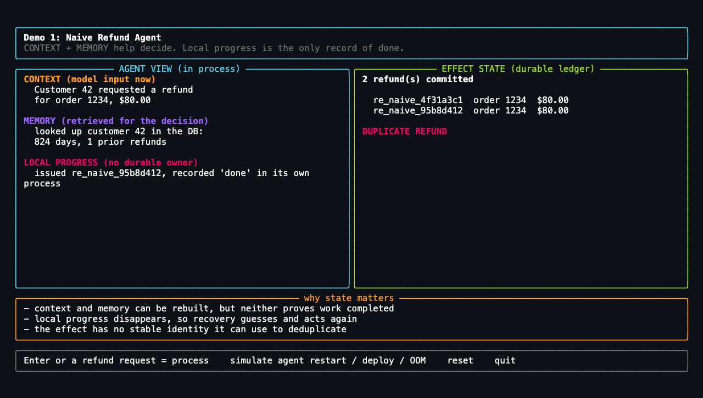

<div align="center">

[](pyproject.toml)
[](https://github.com/temporalio/sdk-python)
[](https://docs.stripe.com/test-mode)
[](https://docs.astral.sh/uv/)

</div>

# Agent Memory and State

**A visual Python demo showing how an agent can remember the conversation and
still forget the work.**

The same refund request goes through two plain-Python agents. The naive agent
rebuilds its context and retrieves the same facts after a Worker restart, but
needs the customer to ask again and may refund them twice. The durable agent
reconnects to the existing Temporal Workflow, resumes the unresolved work, and
can report completion without another customer request. Stripe remains the
effect owner, so a retry with the same identity still resolves to one refund.

There is no agent framework. The point is to make the boundary between context,
memory, and authoritative state visible.

## See the idea in 15 seconds


[Watch or download the MP4 version](assets/demo-reel.mp4).

The reel shows the effect-safety backstop. The guided stage adds the primary
customer-facing payoff: the reloaded agent answers without asking the customer
to submit the refund again.

| Moment | Naive agent | Durable agent |
| --- | --- | --- |
| **Before the request** | Empty process, ready for work | Empty process, ready for work |
| **After the refund call** | The effect exists; its separate completion marker was not written | Temporal records the attempt; Stripe records the effect |
| **Worker disappears** | A new process sees no completion record | The process view disappears; both authoritative records remain |
| **Agent reloads** | The customer asks again; the agent may act again | Reconnects to the same Workflow; **no second request** |
| **Uncertain effect resolves** | A new operation may create a second refund | A retry keeps the same identity; **one refund** |

## The boundary that matters

The useful distinction is operational role and authority, not storage
technology or lifespan. Context, memory, and state can all inform an agent, and
representations of all three can be stored in a database. Ask one question:

> When two copies disagree, which record wins?

| Role | What it answers | Authority |
| --- | --- | --- |
| **Context** | What does the model see for this decision? | Assembled for the current turn |
| **Memory** | What retained or retrieved information does the agent use to reason? | The agent or its memory system |
| **Execution state** | Where does the work stand? | Temporal |
| **Effect state** | Did the refund actually commit? | Stripe |
| **Authorization state** | May the agent act? | The authorization system |
| **Domain state** | What are the business facts? | The application database |

These roles are not mutually exclusive buckets for bytes. Order facts can be
domain state in the application database, copied into the agent's memory, and
then assembled into model context. A database that stores the agent's own
recollections is a memory store; a database that owns the current order record
is authoritative domain state. When copies disagree, the role and owner—not the
database technology—determine which record wins.

The dangerous gap is progress that is not coordinated with the external effect.
Suppose the application calls Stripe and then writes a "done" marker. Stripe can
commit the refund before the marker is written. Even if that marker lives in a
durable database, replacing the process between the two writes leaves the next
process unable to tell whether the refund happened. Persistence protects the
marker after it exists; it does not make the marker and Stripe one atomic
operation.

Read [Memory, state, and authority](docs/CONCEPTS.md) for the complete model,
including working and long-term memory, the lifespan framing, and the
exactly-once misconception.

## What this demo proves

- Reconstructing context does not prove whether a prior effect committed.
- Retrieving the same memory can reproduce the same decision and repeat the
  same mistake.
- Persisting a completion marker after an external effect does not close the
  failure gap between the two systems.
- A durable Workflow records where the work stands across Worker restarts.
- A reloaded agent can reconnect to that Workflow and report running or
  completed work instead of starting a new operation.
- Stripe remains authoritative about whether the refund exists.
- One Workflow identity can become one effect idempotency key.
- Durable execution does not make effects exactly once; it lets a retry ask the
  effect owner instead of guessing.

## The agent loop is ordinary Python

The production Workflow lives in
[`src/refund_agent/workflow.py`](src/refund_agent/workflow.py). This condensed
sketch shows the loop:

```python
decision: RefundDecision | None = None

for _turn in range(MAX_TURNS):
    step = await workflow.execute_activity(
        agent_step,
        args=[request, self.working_memory],
        start_to_close_timeout=timedelta(seconds=60),
    )

    if step.action == "decide":
        decision = RefundDecision(
            recommendation=step.recommendation or "escalate",
            rationale=step.rationale or "",
            source=step.source,
        )
        break

    result = await self._run_tool(step.tool, request)
    self.working_memory.append({"tool": step.tool, "result": result})

if decision is None:
    raise ApplicationError("agent exhausted its turn budget")

if decision.recommendation == "deny":
    return RefundResult(...)

if decision.recommendation != "approve":
    await workflow.wait_condition(lambda: self.approved)

return await workflow.execute_activity(
    issue_refund,
    args=[request, decision, self.working_memory],
    heartbeat_timeout=timedelta(seconds=15),
)
```

The model chooses an approved tool or reaches a decision. The loop is bounded,
Workflow state replays deterministically, and every external call runs as an
Activity.

## Run the guided demo

Prerequisites:

- Python 3.11 or newer
- [Temporal CLI](https://docs.temporal.io/cli)
- [uv](https://docs.astral.sh/uv/)

Install the project, test tools, and Rich terminal UI:

```bash
uv sync --extra dev --extra tui
```

Run the complete comparison in one fullscreen terminal:

```bash
uv run refund-demo stage
```

The guided runner:

1. Shows the empty naive agent asking, "How can I help you?"
2. Shows your request and the agent's “Refund issued” reply.
3. Replaces that Worker before it saves its progress, opening a blank session.
4. Rebuilds the same context and memory, then produces a duplicate refund.
5. Sends the same request through a Temporal Workflow.
6. Replaces the Worker after the effect owner accepts the refund but before the
   Activity reports completion.
7. Reloads the agent, resumes the existing work without another customer
   request, and reports that the refund is complete.

It uses a deterministic policy and offline Stripe-like ledger by default. It
starts a local Temporal dev server only when one is not already reachable and
shuts down only the processes it started.

### Choose how real the run should be

| Command | Model | Refund effect |
| --- | --- | --- |
| `uv run refund-demo stage` | Deterministic | Offline ledger |
| `uv run refund-demo stage --real` | Deterministic | Stripe test mode |
| `uv run refund-demo stage --real-model --model-provider anthropic` | Claude | Offline ledger |
| `uv run refund-demo stage --real --real-model --model-provider anthropic` | Claude | Stripe test mode |
| `uv run refund-demo stage --real-model --model-provider openai` | OpenAI | Offline ledger |

Claude mode requires `ANTHROPIC_API_KEY` and `ANTHROPIC_MODEL`; OpenAI mode
requires `OPENAI_API_KEY` and `OPENAI_MODEL`. Set `AGENT_MODEL_PROVIDER`, or use
`--model-provider`, when both keys are configured. Real refund mode requires a
Stripe `sk_test_` or `rk_test_` key. Live Stripe keys are rejected. Put local
values in `.env`; exported shell variables take precedence.

Test a live model against the offline ledger before combining it with `--real`.
The demo uses a fixed plush-python order, so the spoken request should refer to
order 1234 or the plush python. If a live model denies, the stage now shows its
rationale and the fact that no refund was issued instead of exiting on an empty
screen.

## Read the payoff

The primary payoff is customer-facing:

> The naive agent needs the customer to ask again. The reloaded durable agent
> reconnects to the existing work and says, “Your refund is complete.”

The screenshots below show the supporting effect-safety result. Stripe makes a
repeated call safe; Temporal remembers that the unresolved step still needs to
finish after the original Worker disappears.

| Uncoordinated progress | Authoritative state |
| --- | --- |
| The naive Worker is replaced after the refund but before its separate completion marker, then issues a duplicate. | The durable run can call Stripe twice with one idempotency key and keep one refund. |
|  |  |

The durable side has two owners:

- **Temporal** owns the Activity attempt and execution progress.
- **Stripe** owns whether the refund committed.

A recorded call is not proof that money moved, and a later "done" write cannot
be atomic with Stripe. Temporal durably records the attempt and supplies the
recovery point; the shared identity lets the retry reconcile with Stripe rather
than infer the result from memory or an absent completion marker.

## Explore the demos

| Guide | Use it for |
| --- | --- |
| [Ten-minute talk run of show](docs/TALK_10_MIN.md) | Timed speaker notes, stage cues, fallbacks, and a rehearsal scorecard |
| [Memory, state, and authority](docs/CONCEPTS.md) | The conceptual boundary and system-of-record model |
| [Manual refund demo](docs/REFUND_DEMO.md) | Multi-terminal setup, uncertain-effect beat, replay case, Stripe mode, and event history |
| [Permission state demo](docs/PERMISSION_DEMO.md) | Why remembered authorization is not current authorization |

### Useful commands

| Command | Purpose |
| --- | --- |
| `uv run refund-demo stage` | Run the recommended one-window talk path |
| `uv run naive-refund` | Explore the uncoordinated agent interactively |
| `uv run refund-worker` | Start the Temporal Worker for manual runs |
| `uv run refund-demo watch <id>` | Watch context and memory beside authoritative state |
| `uv run refund-demo inspect <id>` | Inspect a Workflow and its effect calls |
| `uv run permission-chat --panes` | Run the authorization companion demo |

### Tests and visual assets

```bash
uv run --extra dev pytest -q
uv run --extra dev ruff check .
uv run --extra dev ruff format --check .
uv run --extra dev python scripts/render_demo_frames.py
```

### Repository map

```text
src/refund_agent/workflow.py       durable agent loop and Signals
src/refund_agent/activities.py     model, tool, and refund side effects
src/refund_agent/stage.py          guided one-window talk runner
src/refund_agent/naive_refund.py   uncoordinated comparison
src/refund_agent/fake_stripe.py    offline effect ledger
src/refund_agent/permission_chat.py authorization-state companion
assets/                            generated demo reel and screenshots
docs/                              concepts and detailed demo guides
tests/                             agent, effect, stage, and settings tests
```

## Scope

This is a teaching demo, not a production refund service. It has no
authentication, production database, web application, multi-agent
orchestration, or operational hardening.

The demo shows Temporal capturing and replaying execution state. It does not
prescribe how an agent memory system should be stored or managed. Where durable
execution and long-term agent memory best fit together remains an open design
question.

## Acknowledgments

Thanks to Cecil for the review that shaped how this repository frames memory
and state.
