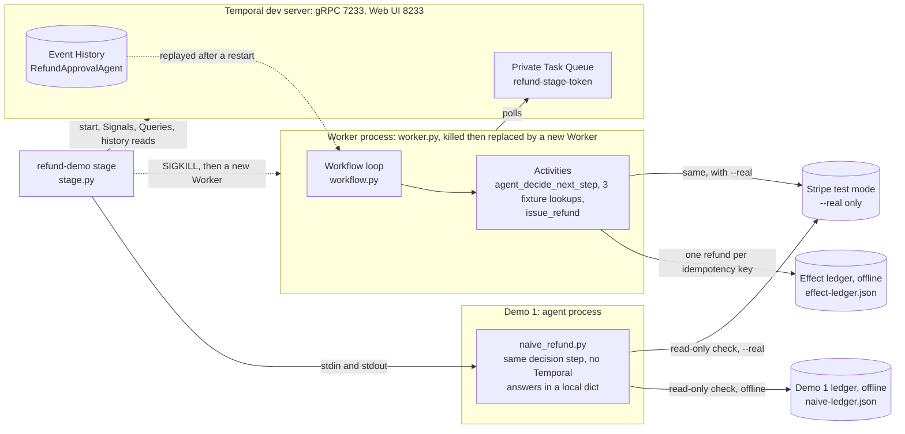

# Agent Memory and State

<div align="center">

[](https://github.com/temporal-community/temporal-ai-agent-memory-state-stripe/actions/workflows/ci.yml)
[](LICENSE)
[](pyproject.toml)
[](https://github.com/temporalio/sdk-python)
[](https://docs.stripe.com/test-mode)
[](https://docs.astral.sh/uv/)

</div>

As agents run longer and take on more complex work, how they handle memory and
state starts to matter. An agent that loses its place partway through a task
can leave a customer repeating themselves, or leave a job half done. Managing
that well starts with knowing the difference between an agent's memory and its
state.

This repo steps you through that difference with a working demo and the
resources behind it. An agent works with four kinds of information:

- **Context:** what the agent has in front of it for the current decision: the
  request, the conversation so far, and the results of its last steps. The
  model reasons only on what's in context, so what goes in, and what's left
  out, shapes every choice it makes. It's sometimes called working memory.
- **Long-term memory:** what the agent carries from one run to the next, such
  as past cases, facts, and instructions. It lives in a store you own, and the
  agent pulls from it into context when it needs it.
- **Execution state:** where the work stands, meaning which steps are done and
  what comes next. Temporal records it in Event History, outside the agent's
  process, so a new process can pick the work back up.
- **Effect state:** whether an action in the outside world, such as a refund,
  actually happened. The system that performed it, Stripe in this demo, is the
  source of truth.

The demo centers on execution state, because that's the part people most often
expect memory to cover. Along the way it shows what memory does well and where
it stops: a memory store can bring back what an agent knew, but it can't tell a
new process where the work stood or whether the last action went through.

**What happens to an AI agent's in-flight work when its process dies?** The
demo kills a customer-support refund agent one step before it refunds the
customer. By then the agent has asked two questions, looked up the order and
the customer's refund history, and chosen `issue refund`.

- **Demo 1, without Temporal:** that progress dies with the agent process, and
  the customer has to start the return again. The failure mode is **lost loop
  position**.
- **Demo 2, with Temporal:** the same loop runs as a Temporal Workflow. A new
  Worker rebuilds it from Event History and resumes at `issue refund` without
  repeating a question.

The agent is a hand-written Python loop with no agent framework, so Temporal's
role is easy to see: it records the execution state outside the agent's
process. A new process can then pick up the work.

<!-- Inline <a id> tags keep older section links (#videos, #resources, and so on) landing in the right place. -->

<a id="see-the-idea-in-15-seconds"></a>[![The demo in eight frames. Demo 1, without Temporal: the agent process collects two answers and two lookups and chooses issue refund, then shows PROCESS GONE. The new agent process has no answers and no next step, checks the offline ledger (paid, no refund), and tells the customer to start the return again. Demo 2, with Temporal: after WORKER GONE, the What Survives pane reads from Temporal 2 customer answers, 2 completed lookups, and next action issue refund. The new Temporal Worker shows NO REPEATED QUESTIONS and NO LOOP RESTART, says "Your refund is complete," and the ledger shows the refund SUCCEEDED.](assets/demo-reel.gif)](assets/demo-reel.mp4)

- **Deck:** [*Agentic Memory and State*, August 2026 (PDF)](docs/agentic-memory-and-state.pdf)
- **Video:** link after publish

**Last verified:** 2026-10-06 (offline demo, failure path, tests). Live model
and Stripe test mode: 2026-10-02.

## Run it

<a id="run-the-guided-demo"></a>**You need:**

- Python 3.11+
- [uv](https://docs.astral.sh/uv/), tested on 0.11.8
- the [Temporal CLI](https://docs.temporal.io/cli), tested on 1.6.2

**Keys:** none for the default run.

```bash
git clone https://github.com/temporal-community/temporal-ai-agent-memory-state-stripe.git
cd temporal-ai-agent-memory-state-stripe
uv sync --extra dev --extra tui
test -e .env || cp .env.example .env   # keeps an .env you already have
uv run refund-demo stage               # fullscreen; press Enter at each prompt
```

The [key lines below](#same-crash-two-outcomes) show what you should see. To
follow each step side by side, see
[what the runner does](docs/GUIDE.md#what-the-runner-does). Every flag and
frame is in [GUIDE.md](docs/GUIDE.md#run-the-stage).

**Watch it in the Temporal Web UI** at <http://localhost:8233>. The demo uses
the dev server at `localhost:7233` and starts its own if none is running. When
the demo exits, it stops any server it started, Web UI included, so if you want
the Web UI to stay open, run `temporal server start-dev` in another terminal
first.

Open the `RefundApprovalAgent` Workflow. Its Workflow ID is
`talk-refund-<token>` by default, with a new token on every run. After the
kill, the Workflow shows `Running` even though no Worker is alive. That is
expected: the Workflow's progress is recorded in Event History, which lives in
the Temporal Service, and the Workflow waits there for a new Worker to pick it
up. The guide shows
[how to find it and what to check at each frame](docs/GUIDE.md#what-to-check-at-each-frame).

### Make targets

Run `make` to list the targets, or `make -n <target>` to print what one runs
without running it.

| Target | Runs | Notes |
| --- | --- | --- |
| `make setup` | `uv sync --extra dev --extra tui` | Installs both extras. A `uv sync` without them removes the Rich terminal view. |
| `make run` | `uv run refund-demo stage` | Runs the key-free path with the fixed policy and the offline ledger. It makes no model calls: 0 tokens, $0. |
| `make run-real` | `uv run refund-demo stage --real` | Needs a Stripe test key, and creates Stripe test objects. |
| `make failure` | `uv run refund-demo stage --simulate-stripe-timeout` | Runs offline and kills the Worker while `issue_refund` is in flight. A new Worker runs attempt 2 with the same idempotency key. For Stripe test mode, run the command with `--real`. |
| `make reset` | `uv run refund-demo cleanup`, then prints the manual steps | Refunds only leftover demo test payments, and only with a Stripe test key. It deletes and stops nothing, and default runs need no reset. For everything else, see [reset between runs](docs/GUIDE.md#reset-between-takes). |
| `make test` | `uv run --extra dev pytest -q` | Runs offline. A passing run ends with `N passed` and exit code 0. |
| `make lint` | `uv run --extra dev ruff check .` and `uv run --extra dev ruff format --check .` | Runs offline. A passing run prints `All checks passed!` and `N files already formatted`. |
| `make typecheck` | `uv run --extra dev mypy` | Runs offline and type-checks `src/`. A passing run prints `Success: no issues found`. |
| `make usage` | `uv run refund-demo usage` | Sums the `LOG_MODEL_USAGE=1` log in `DEMO_STATE_DIR`. If there is no log there, it prints the newest `stage-<token>` folder as a ready-to-run command. |

### Keys and live paths

<a id="choose-the-stage-path"></a>The default run needs no keys. Two flags swap
a stand-in for a live service, and you can use either one or both.

- **`--real`** swaps the offline ledger for Stripe test mode. It needs a
  `STRIPE_API_KEY` that starts with `sk_test_` or `rk_test_`; the demo rejects
  live keys (see [Troubleshooting](#troubleshooting)). It makes no model calls,
  so it still costs 0 tokens and $0. To refund leftover test payments
  afterward, run `make reset`, described under
  [cleanup](docs/GUIDE.md#stripe-test-mode-and-cleanup).
- **`--real-model`** lets a live model choose the lookups and the decision in
  both demos. Choose a provider with `--model-provider openai` or
  `--model-provider anthropic`.
  - For OpenAI, set `OPENAI_API_KEY` and `OPENAI_MODEL`. The measured runs used
    `gpt-5.6-luna`.
  - For Anthropic, set `ANTHROPIC_API_KEY`, and set `ANTHROPIC_MODEL` to
    `claude-sonnet-4-6`. Some newer Claude models
    [reject this code's tool choice](docs/GUIDE.md#troubleshooting). The Claude
    figures in [Cost to run](#cost-to-run) are estimates, not measurements.
  - If both model keys are set and you don't choose a provider, the demo stops
    with an error that asks you to choose one. Pass `--model-provider`, or set
    `AGENT_MODEL_PROVIDER`.
  - [Cost to run](#cost-to-run) has the tokens and dollars, and the guide
    covers [live models](docs/GUIDE.md#live-models) in more depth.

<details>
<summary>Other settings and unattended runs</summary>

Everything else in `.env.example` has a working default, and variables exported
in your shell override `.env`.

The demo waits for Enter at each prompt. To run it with no one at the keyboard,
for example from a coding agent, pipe in Enter presses. The run then accepts
every default and exits 0:

```bash
yes '' | uv run refund-demo stage
```

</details>

## Same crash, two outcomes

Processes end mid-task for ordinary reasons. In production, a deploy, a crash,
an out-of-memory kill, a scale-down or eviction, or a lost host or network can
stop an agent partway through its work. The demo stands in for all of them with
a real SIGKILL.

Both demos stop the same agent right after it chooses `issue refund`, before the
refund reaches Stripe. Only Demo 2 resumes: its new Worker "picks up from the
next step it was supposed to take in that loop, which is to issue the refund,"
as the video puts it.

**What you'll see in a default run**
([full transcript](docs/GUIDE.md#stage-transcript)):

| Moment | Demo 1: without Temporal | Demo 2: with Temporal |
| --- | --- | --- |
| The agent picks its next step | `→ Next: issue refund` | `Next action: issue refund` |
| The process stops before Stripe | `PROCESS GONE` | `WORKER GONE` |
| What's left | Stripe: paid, no refund.<br>The new process: `No answers. No next step.` | `Read from Temporal just now:`<br>2 customer answers, 2 completed lookups, `Next action: issue refund` |
| How it ends | `No refund request reached Stripe.`<br>`Please start the return again.` | `NO REPEATED QUESTIONS`<br>`NO LOOP RESTART`<br>`Your refund is complete.` |

| Demo 1: without Temporal | Demo 2: with Temporal |
| --- | --- |
|  |  |

Between the kill and the new Worker, Demo 2's `WORKER GONE` frame reads Event
History. Event History lives in the Temporal Service, so reading it needs no
Worker:


<a id="whats-written-for-the-demo"></a>**What's written for the demo**

The code follows the patterns you'd use in a real app, plus a few demo-only
hooks so you can watch recovery happen at a predictable moment.

- **A pause before the refund.** The Workflow waits for a `release` Signal
  right before `issue_refund`. The demo stops the Worker during that pause, so
  the crash lands at the same point on every run. After a new Worker starts,
  the demo sends `release` and the refund goes through. A real app has no
  pause: its Worker can stop at any step, and Temporal recovers the same way.
  The flag is `hold_before_effect` in `RefundRequest`
  ([models.py](src/refund_agent/models.py)).
- **A real crash.** Each stop is a real SIGKILL, with no clean shutdown.
- **Answers carried over.** Demo 1's answers go into Demo 2 as Signals, so you
  don't type them twice. Demo 1's new agent process never gets them.
- **Stand-ins.** By default, a fixed policy stands in for the model, so the run
  makes no model calls (0 tokens, $0), and an offline ledger stands in for
  Stripe. Pass `--real-model` for a live model or `--real` for Stripe test
  mode.
- **Failure drills.** Two optional runs stop the Worker in the middle of the
  refund Activity:
  - `make failure` (`--simulate-stripe-timeout`) has no pause. Attempt 1 of
    `issue_refund` hangs before it reaches Stripe, and the demo stops the
    Worker. A new Worker runs attempt 2 with the same idempotency key.
  - `--simulate-stripe-retry` keeps the pause. After `release`, it stops the
    Worker again after Stripe accepts attempt 1 but before Temporal records
    it. Attempt 2 reuses the idempotency key, so the two calls make one
    refund.
  - On these two drills, `fast_recovery` cuts the refund Activity's heartbeat
    timeout from 15 s to 3 s, so Temporal notices the lost Worker within
    seconds. The same flag gives every guided run a 6-minute start-to-close
    timeout for that Activity instead of 1 minute.

The loop, the Activities, the retries, and the idempotency key are written as
you would write them for a real app. Comments in
[models.py](src/refund_agent/models.py),
[workflow.py](src/refund_agent/workflow.py),
[activities/model.py](src/refund_agent/activities/model.py),
[activities/refund.py](src/refund_agent/activities/refund.py), and
[stage.py](src/refund_agent/stage.py) mark each demo-only hook.

<details>
<summary>The Workflow ID, which Stripe lines read Stripe, and what Demo 1 gets right</summary>

- **Why a real app needs the Workflow ID.** The runner holds the Workflow
  ID for you. A real app must keep or derive it, because a restarted
  application needs it to find the run and read its result.
- **Which Stripe lines read Stripe.** Not every Stripe line on screen comes
  from Stripe. The guide lists
  [which do](docs/GUIDE.md#which-lines-read-stripe).
- **What Demo 1 gets right.** Memory and Stripe are both useful, and Demo 1
  isn't wrong to rely on them. After the crash, Stripe's record is correct: the
  payment is paid and has no refund. What Demo 1 lacks is any record of where
  its own work stood, so its new process can't continue the task.

</details>

## Context, memory, and state

<a id="memory-and-execution-state"></a>The four kinds of information at the top
of this page do different jobs, and an agent needs all of them. Only context
lives inside the loop. Long-term memory and the two kinds of state live outside
it, in systems that outlast the agent's process. The table shows what each one
is in this demo and where to find it.

| | What it helps with | In this demo | Where to find it |
| --- | --- | --- | --- |
| **Context** (working memory) | What the model sees for this one decision.<br>The loop sends it again on every turn | The customer's refund request, their two answers, and what the agent has looked up so far: order 1234 and the refund history of the demo customer, Nyghtowl | `working_memory`.<br>Demo 1: a list in the agent process (`naive_refund.py`).<br>Demo 2: a Workflow field (`workflow.py`) that replay rebuilds.<br>In Event History: the input of each `agent_decide_next_step` Activity |
| **Long-term memory** (a memory store) | What the agent carries across runs:<br>Episodic: past cases.<br>Semantic: facts it looks up.<br>Procedural: how-to, such as skill files and tool definitions | None, on purpose. The demo saves nothing between runs.<br>Lookups are labeled `(memory)` on screen because they stand in for a memory store, but they read sample data, and each result becomes part of context once the agent looks it up | Your store: a vector store, a knowledge base, or memory files |
| **Execution state** | Where the work stands: which steps finished and what runs next, so the work can continue after a crash without redoing it | The progress Temporal recorded before the crash: the customer answered two questions, the agent finished two lookups (three when a live model also checks the refund policy), and its next step is to issue the refund | Temporal: the Workflow's Event History in the Temporal Web UI, or `uv run refund-demo inspect <workflow-id>` |
| **Effect state** | Whether the side effect really happened | Whether Stripe actually refunded the payment | Stripe: the Dashboard in test mode. The refund's metadata carries `temporal_workflow_id` and `temporal_idempotency_key`.<br>Offline: the ledger |

<a id="facts-have-owners"></a>**Facts have owners.** Each fact the agent
relies on is owned by one system, and that system's record wins when copies
disagree. Memory says what the agent believed; the owner's record says what
happened. A memory store could bring back the customer's answers, but not which
step runs next (Temporal owns that) or whether the refund went out (Stripe owns
that). An agent that trusts a remembered "not refunded yet" can refund twice.

State is that owner's record. Other components reconcile to it, and it stays
the operational source of truth even when it lags the physical world.

| State | Question | Owner in this demo |
| --- | --- | --- |
| Execution state | Where does the work stand? | Temporal |
| Effect state | Did the real effect commit? | Stripe or the offline ledger |
| Authorization state | May this agent act? | The authorization system (read it live) |
| Domain state | What are the business facts? | The application database |

At the demo's kill, Temporal has recorded the two answers, the completed
lookups, and the next action. Stripe has a paid charge and no refund. The
Worker process holds nothing authoritative. Without a record like Temporal's,
any of the [ordinary reasons a process stops](#same-crash-two-outcomes) can
remove loop position right where the application still owes work.

For any fact, ask whether another system already owns it. Asked of every fact,
that question finds more kinds of state than the four in this table, such as
token budgets, locks, and quotas.

**Temporal is not a memory store.** It records execution state, such as one
run's Signals and its Activity inputs and results, in Event History, which
lives in the Temporal Service rather than in the Worker. That's enough to
rebuild this run's working memory by replay, but it isn't a place to keep what
the agent knows from one run to the next.

- Long-term memory belongs in a store you own.
- Event History has size limits, described under [Gotchas](#gotchas).
- Temporal can run the store's reads and writes as Activities, so each one is
  recorded and retried like any other step.
- How best to combine the two is still an open design question.

<details>
<summary>More on memory, state, and authority</summary>

- **Roles, not storage types.** The same data can play more than one role. An
  order row is domain state, owned by your database. Once the agent looks it
  up, it is part of working memory, and a summary the agent keeps of it is
  long-term memory. When they disagree, the order row still wins.
- **Authority, not lifespan.** Execution state isn't simply short-lived, and
  memory isn't simply durable. Event History survives Worker restarts but is
  deleted after its retention period, while a memory store can keep a fact for
  years. When they disagree, the owner's record wins, however long each one
  lasts.
- **After the effect.** If the process dies after Stripe accepts the refund but
  before anything on your side records it, only Stripe knows the refund went
  out. The retry reconciles with Stripe by sending the same idempotency key,
  instead of trusting memory. This demo crashes before the refund, because
  that is where the customer's cost is visible. The
  [later-loss walkthrough](docs/GUIDE.md#later-loss-after-stripe-accepts-the-refund)
  covers the crash after it.
- **Authorization is state too.** Remembering "you may push" doesn't mean the
  grant is still active, so read it live from the authorization system, never
  from memory. See the
  [companion demo](docs/GUIDE.md#authorization-companion-demo).
- **Why the table says context.** Working memory is what the model works with
  on this turn. The context window holds it, and context management selects and
  refreshes it. Here the model sees all of it on every turn, so the table calls
  it context. "Memory" on its own usually means long-term memory in a store.
- **Parametric memory** is what the model learned in training. It lives in the
  weights, you can't see or edit it while the agent runs, and only retraining
  or fine-tuning changes it. When the weights and a record disagree, the record
  wins.
- **Memory has no authority on its own.** Unless provenance and freshness are
  attached and checked, an agent can't tell which of its memories it observed,
  which it inferred, and which went stale after a change elsewhere.
- **Memory can be the only record** of some things, such as the agent's plan,
  or that a customer sounded upset.
- **The store doesn't set the role.** A table of the agent's reflections can be
  a memory store, an orders table can be a domain-state store, and Event
  History records execution state.
- **The idempotency key follows the Run ID.** It stays the same across retries
  in one run. It changes on a reset, on a new run that reuses the Workflow ID,
  and on Continue-As-New.
- **Temporal doesn't hand the result to the agent.** It doesn't inject a
  Workflow's status or result into a model or a UI; your application surfaces
  it.

</details>

## Demo takeaways

<a id="what-this-demo-proves"></a><a id="takeaways"></a>The demo ends on these three points:

- **Without Temporal, the customer had to start over.** The answers and next
  step lived only in the agent process, and they died with it.
- **With Temporal, a new Worker picked up at the recorded next action,**
  `issue refund`, without asking the customer again. Replay runs the Workflow
  code again from the top, and each finished step returns its recorded result
  instead of running again. As the video puts it, "It didn't redo all those
  steps. It just replayed it."
- **Memory helps reasoning continue. Temporal helps the operation continue.**
  Stripe, not either of them, knows whether money moved.

## Architecture


You run one command, `uv run refund-demo stage`
([`stage.py`](src/refund_agent/stage.py)). It runs Demo 1, then starts Demo 2's
Workflow, sends it Signals, and starts and kills its Worker.

- **Demo 1** runs the loop in an ordinary Python agent process
  ([`naive_refund.py`](src/refund_agent/naive_refund.py)). The customer's
  answers, what the agent observed, and its next step live only in that
  process's memory, so they die with it.
- **Demo 2** runs the same loop as the `RefundApprovalAgent` Workflow
  ([`workflow.py`](src/refund_agent/workflow.py)). A Worker process
  ([`worker.py`](src/refund_agent/worker.py)) runs the Workflow and its
  Activities ([`activities/`](src/refund_agent/activities/)), which make the
  model call ([`model.py`](src/refund_agent/activities/model.py)), the lookups
  ([`tools.py`](src/refund_agent/activities/tools.py)), and the `issue_refund`
  call ([`refund.py`](src/refund_agent/activities/refund.py)).
- **After the kill,** a new Worker replays Event History. It runs the Workflow
  code again from the top, and each Activity that already finished returns its
  recorded result instead of running again. That rebuilds `working_memory`, and
  the loop resumes at `issue_refund`.
- **Temporal handles every retry.** The model and Stripe SDKs' own retries are
  off, so each retry is an Activity attempt that Temporal schedules and tracks,
  not a hidden retry inside one SDK call. Event History records each step and
  its result.
- **Every `issue_refund` attempt in a run sends the same idempotency key,** to
  the offline ledger ([`fake_stripe.py`](src/refund_agent/fake_stripe.py)) by
  default or to Stripe test mode with `--real`. A refund call that was in
  flight when a Worker died can run again, and the key keeps that retry from
  creating a second refund.

### The agent loop and its five Activities

The loop itself is Workflow code. On each turn it calls one Activity to decide
what to do next, and then does it. The agent has five Activities it can run:

| Activity | What it does |
| --- | --- |
| `agent_decide_next_step` | Asks the model, or the fixed policy in offline runs, for the next step: ask the customer a question, call one of the lookups, or decide. |
| `lookup_order` | Reads the order the customer wants refunded. |
| `lookup_customer_history` | Reads the customer's past refunds. |
| `check_refund_policy` | Checks whether the order qualifies for a refund. It runs only when the model or the fixed policy asks for it, and the default run doesn't. |
| `issue_refund` | Sends the refund with the run's idempotency key. It's the loop's only side effect, and it runs only after the decision is to refund. |

The customer's answers aren't Activities. They arrive as Signals, and the
Workflow waits for each one. Because Event History records each Activity's
input and result, a new Worker can replay the loop without calling the model
or the lookups again.

<details>
<summary>Detailed wiring: diagram, loop, retries, idempotency key, and timeouts</summary>


```mermaid
flowchart LR
    accTitle: How the guided demo is wired
    accDescr: The refund-demo stage command drives both demos. Demo 1 is an agent process that runs the same decision step with no Temporal and keeps its answers in memory, and after it is killed a new process reads only what Stripe, or the offline ledger, records about the payment. Demo 2 starts a Temporal Workflow on a local dev server. A separate Worker process polls a private Task Queue on that server and runs the Workflow loop and its Activities. The runner kills that Worker and starts a new one, which replays Event History to rebuild the loop and then issues one refund to the offline effect ledger, or to Stripe test mode with --real.
    stage["refund-demo stage<br/>stage.py"]
    subgraph demo1["Demo 1: agent process"]
        naive["naive_refund.py<br/>same decision step, no Temporal<br/>answers in a local dict"]
    end
    subgraph server["Temporal dev server: gRPC 7233, Web UI 8233"]
        queue["Private Task Queue<br/>refund-stage-token"]
        history[("Event History<br/>RefundApprovalAgent")]
    end
    subgraph worker["Worker process: worker.py, killed then replaced by a new Worker"]
        wf["Workflow loop<br/>workflow.py"]
        acts["Activities<br/>agent_decide_next_step, 3 fixture lookups,<br/>issue_refund"]
    end
    naiveLedger[("Demo 1 ledger, offline<br/>naive-ledger.json")]
    effectLedger[("Effect ledger, offline<br/>effect-ledger.json")]
    stripe[("Stripe test mode<br/>--real only")]
    stage -->|"stdin and stdout"| naive
    naive -->|"read-only check, offline"| naiveLedger
    naive -->|"read-only check, --real"| stripe
    stage -->|"start, Signals, Queries, history reads"| server
    worker -->|"polls"| queue
    history -.->|"replayed after a restart"| wf
    wf --> acts
    acts -->|"one refund per idempotency key"| effectLedger
    acts -->|"same, with --real"| stripe
    stage -.->|"SIGKILL, then a new Worker"| worker
```

The change from Demo 1's loop is small:

| Demo 1: the loop without Temporal (`_run_interactive_agent_loop`) | Demo 2: Temporal Workflow loop |
| --- | --- |
| `step = decide_next_step(request, working_memory)` | `step = await workflow.execute_activity(agent_decide_next_step, args=[request, self.working_memory], ...)` |
| `answer = sys.stdin.readline()` | A `customer_answer` Signal, then `await workflow.wait_condition(...)` |
| `working_memory.append(result)`, held in RAM | `self.working_memory.append(result)`, rebuilt by replay after a restart |

**The loop.** The full loop is in
[`workflow.py`](src/refund_agent/workflow.py). It is bounded at
`MAX_TURNS = 10`, so a model that never reaches a decision makes the run fail
instead of looping forever. In the guided demo, code, not the model, asks the
two intake questions before any model step, so every provider starts from the
same answers. `refund-demo start` leaves those questions off.

**The demo runner.** `stage.py` connects to a Temporal dev server at
`localhost:7233`, or starts one if none is running. While a Worker runs, the
runner polls the `stage_progress` Query to follow the Workflow, and it reads
Event History to draw each Demo 2 frame.

**Demo 1.** Each turn calls `decide_next_step`, the same function behind Demo
2's `agent_decide_next_step` Activity. After the kill, the new process can read
only what Stripe, or the offline ledger, records about the payment.

**Demo 2.** Customer answers arrive as `customer_answer` Signals, and the
Temporal dev server records each step in Event History.

**Retries.** The model clients set `max_retries=0`, and the Stripe client sets
`max_network_retries = 0`. With SDK retries on, the SDK would retry inside one
call, where Temporal can't see it. With them off, Temporal sees each attempt:
the Activity decides whether a failure can be retried, and Temporal runs the
next attempt.

- A 429, a 5xx, a timeout, or a dropped connection is retried. Other 4xx
  errors are not.
- A Stripe 409 is retried, because Stripe sends it while an earlier call with
  the same key is still running.
- A Stripe connection error follows the SDK's `should_retry`.
- A `Stripe-Should-Retry` header overrides the status code, whether it says
  `true` or `false`.
- When `Retry-After` is 60 s or less, the next attempt waits it out.

**Idempotency key.** The key is `durable-refund-` plus the SHA-256 of
`<workflow_id>:<run_id>`. Because it comes from the run's identity, it is the
same on every `issue_refund` attempt in a run.

**`issue_refund` timeouts.** The Activity heartbeats every second while it
waits on Stripe. If no heartbeat arrives within the heartbeat timeout, Temporal
treats the Worker as lost and starts the next attempt, so a slow Stripe call
that keeps heartbeating isn't mistaken for a lost Worker.

- The heartbeat timeout is 15 s. The `--simulate-stripe-*` paths use 3 s, so
  attempt 2 starts within seconds of the kill.
- Start-to-close limits one attempt: 6 minutes in the guided demo, and 1
  minute otherwise.
- Schedule-to-close limits all attempts together: 10 minutes.
- The Activity gets up to 10 attempts.
- The model-call limits are under Model settings in
  [Cost to run](#cost-to-run).

</details>

### Where things live

Code is in `src/refund_agent/`, docs in `docs/`.

<details>
<summary>Source files and other entry points</summary>

```text
src/refund_agent/stage.py            the guided demo runner (refund-demo stage)
src/refund_agent/naive_refund.py     Demo 1: the agent process
src/refund_agent/workflow.py         Demo 2: the RefundApprovalAgent Workflow and its Signals
src/refund_agent/worker.py           the Worker process (refund-worker)
src/refund_agent/activities/        the Activities, split by role:
  model.py                           agent_decide_next_step, the fixed policy, live model calls, usage log
  tools.py                           lookup_order, lookup_customer_history, check_refund_policy
  refund.py                          issue_refund, the Stripe call, and the idempotency key
  view.py                            display helpers that print each step and mirror the agent's view
src/refund_agent/fake_stripe.py      offline ledger (Stripe stand-in) and idempotency key
src/refund_agent/tui.py              terminal panels and the Event History read
src/refund_agent/cli.py              refund-demo commands: start, stop, result, inspect, watch, usage, cleanup, and more
src/refund_agent/permission_chat.py  authorization companion demo
assets/                              demo reel, screenshots, architecture diagram
docs/                                guide, history growth, talk notes, deck
tests/                               agent loop, ledger, stage, settings, and panel tests
```

**Other entry points.** Each of these runs on its own:

- `uv run naive-refund` runs Demo 1's agent process.
- `uv run refund-worker` starts a Worker.
- `uv run refund-demo inspect <workflow-id>` prints one Workflow's status and
  the steps recorded in its Event History.
- `uv run permission-chat --panes` runs the authorization companion demo.

The [manual walkthrough](docs/GUIDE.md#manual-walkthrough) runs each process in
its own terminal.

</details>

### Tests

`make test`, `make lint`, and `make typecheck` all run offline, and
[Make targets](#make-targets) says what a passing run prints.

- **Replay test.** `make test` includes
  [`tests/test_replay.py`](tests/test_replay.py), which replays a saved Event
  History against the current Workflow code. A change that breaks replay of
  that history fails the suite.
- **CI.** [GitHub Actions](.github/workflows/ci.yml) runs lint, the type check,
  and the tests on every push to `main` and on every pull request.
- **Screenshots.** To regenerate the deterministic HTML frames that become the
  README's screenshots and demo reel, run
  `uv run --extra dev python scripts/render_demo_frames.py`.

## Cost to run

Starting over repeats every model call and pays for each one again. Replay
returns the recorded results of finished calls, so it doesn't pay for them
again; only a call that was in flight at the crash can run twice.

The measured runs show the difference between the two demos:

- Before the kill, each demo's pass made 4 model calls: 2,962 tokens and
  $0.0009 in Demo 1, and 2,946 tokens and $0.0009 in Demo 2.
- After the kill, Demo 1's customer has to start over, which costs 4 more
  calls: 2,972 tokens and $0.0009 more.
- After the kill, Demo 2's replay made 0 calls, so it cost 0 tokens and $0.

These figures come from `--real-model` on GPT-5.6 Luna, measured on 2026-10-02
at list prices as of 2026-09-29. Without `--real-model`, the demo uses a fixed
policy and makes no model calls, so it costs 0 tokens and $0. `--real` alone
also makes no model calls.

| Run | Calls | Tokens | Dollars | Basis |
| --- | --- | --- | --- | --- |
| Demo 1 pass, `gpt-5.6-luna` | 4 | 2,962<br>In: 2,619, 0 cached<br>Out: 343, 87 reasoning | $0.0009 | **Measured**, 2026-10-02 |
| Demo 1 start-over, as the customer must | 4 more | 2,972<br>In: 2,623<br>Out: 349, 97 reasoning | $0.0009 more | **Measured**, 2026-10-02 |
| Demo 2 pass, before the kill | 4 | 2,946<br>In: 2,611<br>Out: 335, 84 reasoning | $0.0009 | **Measured**, 2026-10-02 |
| Demo 2 replay after the kill | 0 | 0 | $0.00 | **Measured**, 2026-10-02 |
| Each demo, or a Demo 1 start-over, on `claude-sonnet-4-6` | about 4 | about 5,600-7,300<br>In: 5,400-6,900<br>Out: 200-400 | about $0.02-$0.03 | **Estimated**, 2026-09-29<br>Not run |

<!-- After a measured Claude pass, replace the Claude estimate with the
measured calls, tokens, dollars, and date. -->

**At scale (estimate).** At 1M requests a month, each the size of the measured
Demo 1 pass, the model calls come to about 3B tokens and about $900. The
estimate counts model calls only and uses GPT-5.6 Luna list prices as of
2026-09-29. Every request that starts over pays its share again.

<details>
<summary>How these were measured, prices, model settings, and what raises the cost</summary>

**How these were produced.** The measured figures come from one
`stage --real --real-model --model-provider openai` run, logged with
`LOG_MODEL_USAGE=1` and summed by `refund-demo usage`. The Demo 1 start-over
was run once more outside the guided demo, with the same answers, and stopped
at the same point, before Stripe.

- **Replay made 0 calls.** All 4 Demo 2 calls happened before the Worker was
  killed, no usage record followed the kill, and Event History shows each agent
  turn once.
- **An earlier pass on 2026-09-30** ran before Demo 1 used the model, while the
  prompts still showed cents. It made the same 4 calls in Demo 2, for 2,845
  tokens and $0.0009.
- **The Claude figures are estimates.** The call count comes from the code, and
  the tokens come from rebuilding the exact prompts at 2.5-4 characters per
  token. No tokenizer or paid call was used.

**Prices.** These are list prices as of 2026-09-29, per million tokens:

- **GPT-5.6 Luna** ([OpenAI](https://developers.openai.com/api/docs/pricing)):
  $0.20 in, $0.02 cached in, $0.25 cache write, and $1.20 out. Reasoning is
  billed as output, and prompt caching is automatic for prompts of 1,024 tokens
  or more.
- **Claude Sonnet 4.6** ([Anthropic](https://platform.claude.com/docs/en/about-claude/pricing)):
  $3 in, $0.30 cache read, $3.75 cache write, and $15 out.
- Stripe test mode and the local dev server are free.

**Temporal Cloud** ([Temporal pricing](https://temporal.io/pricing)). A pass is
an estimated 20-165 billable Actions, which costs under one cent at $50 per
million Actions. The count comes from the code, not a measurement: 1 start,
8-10 Activity starts, 2-3 Signals, and 10-150 polled `stage_progress` Queries.

**Model settings.**

- GPT-5.6 Luna uses the Responses API with a required tool call, the default
  reasoning effort, and no output cap.
- Claude Sonnet 4.6 uses `max_tokens=512` and forced tool choice, with no
  extended thinking and no prompt caching.
- Both clients have SDK retries off and a 45 s client timeout.
- Demo 2 retries each model turn through Temporal, up to 5 attempts of 60 s
  each. Demo 1 has no retry layer.

**What raises the cost:**

- **Retries.** Most follow a 429, a 5xx, or a connection error, and those
  usually bill nothing. A turn bills twice when the provider responded but the
  Worker never got the response, either because the 45 s client timeout fired
  first or because the Worker was lost mid-call.
- **A call in flight at a crash.** It runs again after its 60 s Activity
  timeout and can bill again. In the guided demo, the kill lands after the last
  model call.
- **More turns and longer context.** The loop allows 10 turns, and in the
  guided demo 2 of them are code-driven intake questions. Every call resends
  the request and all observations.
- **Reasoning tokens.** No reasoning effort or output cap is set for OpenAI
  models.
- **More runs.** Each live run calls the model in both demos, and a Demo 1
  start-over is one more pass.
- **The manual path.** `refund-demo start --dry-run` makes no model calls only
  when no model key is configured.

**Worst case.** This is a risk estimate modeled from the code. It is not a
measurement, and it is not a ceiling. It assumes about 2,000 input tokens per
call for the default request, since your request text is resent on every call. It bills every Claude call at the
512-token output cap, and every GPT-5.6 Luna call at about 2,100 output plus
reasoning tokens.

- A guided-demo run can make 48 calls: Demo 2's 8 model turns at 5 attempts
  each, plus Demo 1's 8 turns. On Claude that is about 96,000 tokens in and
  24,576 out, about $0.66. On GPT-5.6 Luna it is about 96,000 in and 100,800
  out, about $0.14.
- A manual `refund-demo start` on Claude can make 50 calls, 10 turns at 5
  attempts each: about 100,000 tokens in and 25,600 out, about $0.68.

</details>

**Measure it yourself.**

```bash
LOG_MODEL_USAGE=1 uv run refund-demo stage --real-model --model-provider openai
# The run ends with a line such as:  Stage logs: .demo-state/stage-1a2b3c4d
uv run refund-demo usage --state-dir .demo-state/stage-1a2b3c4d
```

<details>
<summary>What the usage log records and how <code>usage</code> prices it</summary>

**The log** has one JSON line per live model call. Each line records which
demo made the call (`naive` for Demo 1, `temporal` for Demo 2), the provider
and model, the input, cached input, and cache writes, the output and reasoning
tokens, and a timestamp. It never records prompt text or keys.
`LOG_MODEL_USAGE=1` can also go in `.env`, and the Worker and Demo 1's agent
process inherit it. Each run logs to its own `stage-<token>` folder, so one
file is one run.

**How `usage` prices it.** It reports Demo 1 and Demo 2 separately, with
dollars at list prices. Reasoning tokens are already inside output, so it never
adds them twice.

- For another model, pass `--input-price` and `--output-price` together, both
  in USD per million tokens. Cached input and cache writes are then priced at
  the input price.
- In a run with a kill, only calls that returned a response are logged, because
  an error is raised before a response exists. Check such a run against the
  provider's usage console.
- With any measured figure, record the model, the model settings, and the date.

</details>

## How other approaches compare

Most agent products keep memory (what the agent knows) or a transcript. Several
also keep execution state for their own runtime.

| Kind | Examples | After a crash |
| --- | --- | --- |
| Memory layers and transcript stores | Mem0, Letta, Anthropic memory tool, OpenAI Agents SDK Sessions | Restore what the agent knows.<br>A new process decides again |
| Execution state inside one agent runtime | LangGraph checkpointers, LangSmith Deployment, OpenAI Agents SDK `RunState`, Google ADK Resume | Resume within that runtime.<br>Some re-run a step, so effects still need idempotency keys |
| Execution state you build | Postgres job table with a recovery point | A completer process you write |
| Durable execution, not tied to an agent framework | Temporal (this demo), DBOS | Resume from recorded steps.<br>Temporal: any Worker polling the Task Queue.<br>DBOS: the app, from its last completed step |

Persisted chat history lets a new process decide again. Durable execution
resumes the decision the agent already made.

<details>
<summary>Product by product, as read on 2026-09-29, and why a checkpoint can run a step twice</summary>

A checkpoint recovers position, not a call that already went out. In a
LangGraph checkpointer and in Temporal alike, a step running at the crash runs
again ([Gotchas](#gotchas)).

Each row is scoped to the linked pages as read on 2026-09-29.

| Product | What it keeps | Who resumes after a crash | Compared with this demo |
| --- | --- | --- | --- |
| [LangGraph checkpointers](https://docs.langchain.com/oss/python/langgraph/checkpointers) | Graph state per `thread_id` at every super-step, including the next node.<br>The Store holds long-term memory across threads | Your code re-invokes the graph with the same `thread_id` | The closest open-source analogue.<br>With a durable checkpointer such as Postgres, a crash after the decision can resume at the next node.<br>A resumed node runs again from its start ([interrupts](https://docs.langchain.com/oss/python/langgraph/interrupts)), so effects need idempotency.<br>`InMemorySaver` loses its checkpoints on restart |
| [LangSmith Deployment](https://docs.langchain.com/langsmith/agent-server) | Runs on a durable task queue, with checkpoints in Postgres | Another queue worker, from the latest checkpoint ([LangChain](https://www.langchain.com/blog/runtime-behind-production-deep-agents)) | For a LangGraph graph deployed there, this covers the crash-and-resume step shown here.<br>Temporal also runs without a framework and sets retry and heartbeat policy per Activity.<br>Temporal has a [LangGraph plugin](https://temporal.io/blog/temporal-langgraph-plugin-durable-execution) |
| [OpenAI Agents SDK](https://openai.github.io/openai-agents-python/sessions/) | Session items.<br>A `RunState` saved at an [approval interruption](https://openai.github.io/openai-agents-python/human_in_the_loop/) | Your code restores the `RunState` and runs it again | A Session restores the answers.<br>Resuming at a chosen action needs a `RunState` you design, or [Temporal's integration](https://docs.temporal.io/develop/python/integrations/openai-agents) |
| [Letta](https://docs.letta.com/guides/core-concepts/stateful-agents) | Stateful agents on the Letta server, with core, recall, and archival memory | A client reconnects to a [background run](https://docs.letta.com/v1-sdk/messages/long-running) by run and sequence ID | Keeps what the agent knows across client crashes.<br>A refund still needs its own idempotency key |
| [Mem0](https://docs.mem0.ai/core-concepts/memory-types) | Memories an LLM extracts and reconciles, scoped by user, agent, or run | n/a (a memory layer) | Suits facts that carry across sessions, such as a customer's preferences.<br>Not an execution position.<br>Here it would sit beside the loop, called from an Activity |
| [Google ADK Resume](https://adk.dev/runtime/resume/) | Session events, scoped state, a MemoryService, and a log of completed steps | The client re-invokes with the `invocation_id` | Draws nearly the same line between state and memory.<br>Tools may run again on resume |
| [Anthropic memory tool](https://platform.claude.com/docs/en/agents-and-tools/tool-use/memory-tool), context editing, and compaction | `/memories` files the model writes and your app stores.<br>Context editing and compaction manage what fits in the window | Your app, from the files the model wrote | Good for coding agents.<br>For a refund, a crash between Stripe accepting it and the note being written loses the record that it went out |
| [Postgres job table](https://brandur.org/idempotency-keys) | One row per request with a `recovery_point` | A completer process you write | Real execution state.<br>You build the leases, retries, timeouts, durable waits, and inspection.<br>Fixed recovery points suit a fixed pipeline. This loop's steps are chosen by a policy or model at run time |
| [DBOS](https://docs.dbos.dev/integrations/openai-agents) | Checkpointed steps in Postgres or SQLite | The app, from the last completed step | The same category as Temporal, run as a library with no separate server |
| Temporal (this demo) | Event History of Signals and Activity inputs and results.<br>Workflow fields rebuilt by replay | Any Worker polling the Task Queue | Not tied to a framework.<br>Per-Activity retry and heartbeat policies, durable waits, and the Web UI.<br>Its costs are under [What it is not](#what-it-is-not) |

</details>

### When you need durable execution

<a id="when-you-dont-need-temporal"></a>Durable execution earns its place when
the work:

- outlives a process or a deploy,
- waits a long time on people or other systems, or
- retries side effects that are real, such as a refund.

**You may not need it when:**

- **The loop is short and the user is right there.** If a run is lost, the
  user just asks again.
- **Redoing a step is cheap and safe.** A chat with no irreversible side
  effects can rely on a session store, and a coding agent's changes live in
  git.
- **Recovery is already handled.** Your runtime keeps execution state for you,
  as LangSmith Deployment, ADK Resume, and DBOS do, or there is a single
  side-effecting call that you retry right away with the same idempotency key.

## Gotchas

<a id="when-event-history-grows-claim-check-and-continue-as-new"></a>**Event History grows every turn.**
Each turn sends all of `working_memory` to the model step again, and Event
History records that input every time. The input gets longer with each turn,
so the history grows with the square of the turn count. The server's defaults
allow 2 MB per payload and 50 MB per run. This demo stops at
`MAX_TURNS = 10`, which keeps it under 7 KB of payloads.
[HISTORY_GROWTH.md](docs/HISTORY_GROWTH.md) has the limits, a
[measured example](docs/HISTORY_GROWTH.md#measured-in-the-fleet-demo), and a
[Continue-As-New sketch](docs/HISTORY_GROWTH.md#what-continue-as-new-looks-like-sketch).

<details>
<summary>Two fixes: claim check and Continue-As-New</summary>

- **A claim check handles one big result.** Keep the data in your own store and
  put only a small key in Event History. Temporal's
  [External Storage](https://docs.temporal.io/external-storage) does this for
  payloads.
- **Continue-As-New handles a long run.** It starts a fresh Event History with
  the same Workflow ID and a new Run ID. Temporal suggests it when the history
  gets long, and your Workflow code makes the call. This demo should roll over
  only before the refund, because the idempotency key uses the Run ID. A
  refund attempted in a new run would carry a different key, and Stripe
  couldn't tell it was a retry.

</details>

**A step can run more than once.** Replay doesn't redo finished steps, but a
step that was running when the Worker died has no recorded result, so Temporal
runs it again. Give every side effect an idempotency key that the receiving
system checks. `issue_refund` does this: every attempt in a run sends the same
key, so Stripe makes one refund.

**What not to change.** [AGENTS.md](AGENTS.md) has every rule.

<details>
<summary>The four rules this demo depends on</summary>

- Keep Workflow code deterministic. Model calls, network calls, and file access
  belong in Activities.
- Keep SDK retries off on the model and Stripe clients, so Temporal is the
  only retry layer.
- Keep the idempotency key the same on every retry in a run.
- Keep rejecting live Stripe keys.

</details>

## What it is not

- **Not a production refund service.** It leaves out authentication, a
  production database, a web application, multi-agent orchestration, and
  hardening. Its lookups read fixtures, and it runs on a local dev server, not
  Temporal Cloud, with no TLS or API-key options for the connection.
- **Not a guarantee that each step runs once.** A step that was running when
  the Worker died runs again, so the refund relies on its idempotency key
  ([Gotchas](#gotchas)).
- **Not a memory store.** [Context, memory, and state](#context-memory-and-state)
  explains why.
- **Not a fix for model quality.** Temporal doesn't decide what the agent does
  or make the model right; evals and guardrails do.
- **Demo 1 is not a Temporal Worker.** It runs the same decision step with no
  Temporal and no retry layer, and the screens call it the agent process.
- **Not free of trade-offs.**
  - Event History holds customer data, so plan its retention and add an
    encryption codec.
  - Event History has size limits; see [Gotchas](#gotchas).
  - Someone has to run the Temporal Service or pay for Temporal Cloud.
  - Workflow code must be deterministic and versioned.
  - See also [when you need durable execution](#when-you-need-durable-execution).

## Troubleshooting

**If the demo won't start**, it's almost always one of these. The demo's own
errors start with `STAGE |`.

| What you see | Why | Fix |
| --- | --- | --- |
| ``STAGE \| Temporal is not reachable and the `temporal` CLI is not on PATH`` | The demo needs a local Temporal server, and it can't find or start one. | Install the Temporal CLI, or run `temporal server start-dev` in another terminal first. |
| `STAGE \| Temporal dev server exited while starting:` | Usually another program is already using port 7233 or 8233. | Find it with `lsof -nP -iTCP:7233 -iTCP:8233 -sTCP:LISTEN`. Stop it if it's yours, or [run the demo on other ports](docs/GUIDE.md#start-your-own-dev-server). |
| `STAGE \| Worker exited while starting:` | Usually a live or malformed `STRIPE_API_KEY` in `.env`. The Worker checks the key even in offline runs. | Use a `sk_test_` or `rk_test_` key, or remove it. |

For anything else, check `.demo-state/stage-<token>/worker.log` and the
Temporal Web UI, where Workflow and Activity failures show, or see the
[full troubleshooting list](docs/GUIDE.md#troubleshooting).

## Where to go next

### Video

<a id="videos"></a>**Temporal & AI Series: Agent Memory & State.** Video and playlist links go
here after publish.

The video ran
`uv run refund-demo stage --real --real-model --model-provider openai` with an
OpenAI key and a Stripe test key. Without keys, `make run` tells the same story
offline.

<details>
<summary>Chapters</summary>

- **0:00** The problem
- **0:13** Demo 1: a refund agent without Temporal
- **1:20** Why memory can't resume the work
- **1:45** Agents are loops (and autonomy levels)
- **3:07** Context vs. memory vs. state
- **4:16** Kinds of memory and managing context
- **5:41** State: who owns the facts
- **6:27** What Temporal is: core concepts
- **7:38** Demo 2: the same test with Temporal
- **9:08** Replay, not redo
- **9:38** History limits: claim check and Continue-As-New
- **10:48** When you need durable execution
- **11:21** Cost: restart vs. replay
- **12:02** The takeaway
- **12:16** Run it yourself

</details>

### Docs in this repo

<a id="explore-the-demos"></a>

- [GUIDE.md](docs/GUIDE.md) is the full reference for running and presenting
  the demo. It covers every `stage` flag, what the Web UI shows at each frame,
  the full output, the manual walkthrough, the authorization demo, and every
  error.
- [HISTORY_GROWTH.md](docs/HISTORY_GROWTH.md) explains Event History limits,
  the claim check, and Continue-As-New.
- [AGENTS.md](AGENTS.md) holds the rules for coding agents, including what not
  to change.

### As presented

The September 2026 talk ran the code tagged
[`as-presented-2026-09`](https://github.com/temporal-community/temporal-ai-agent-memory-state-stripe/tree/as-presented-2026-09).
`main` keeps moving, so link the tag when you cite the talk.

### Further reading

<a id="resources"></a>

- [Temporal docs](https://docs.temporal.io) and the
  [Python SDK](https://github.com/temporalio/sdk-python)
- [Continue-As-New](https://docs.temporal.io/workflow-execution/continue-as-new)
  and [External Storage](https://docs.temporal.io/external-storage)
- [Stripe idempotent requests](https://docs.stripe.com/api/idempotent_requests)
- **For your coding agent:** the
  [Temporal developer skill](https://github.com/temporalio/skill-temporal-developer),
  installed with `npx skills add temporalio/skill-temporal-developer`

<!-- TODO before publishing: video URL with UTM and the Temporal & AI Series
playlist URL (in Where to go next, and under the GIF), related videos
(human-in-the-loop, multi-agent handoffs), the blog post URL if there is one,
and Temporal Cloud credits when available. -->

## Acknowledgments

Thanks to Cecil, Johann, Tushar, Tom, Melissa, and Cornelia for the reviews
that shaped how this repository frames memory and state.

## License

Released under the [MIT License](LICENSE).

---

**Ready to try this in your own agent?** [Get started here](https://t.mp/ai-video-cta-004).
