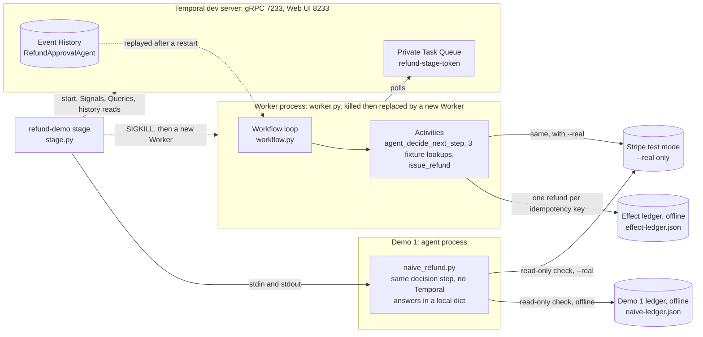

# Agent Memory and State

<div align="center">

[](LICENSE)
[](pyproject.toml)
[](https://github.com/temporalio/sdk-python)
[](https://docs.stripe.com/test-mode)
[](https://docs.astral.sh/uv/)

</div>

**What happens to an AI agent's in-flight work when its process dies?** This
demo kills a customer-support refund agent one step before it refunds the
customer. By then it has asked two questions, looked up the order and the
customer's refund history, and chosen `issue refund`.

- **Demo 1, without Temporal:** that progress dies with the agent process, and
  the customer has to start the return again. The failure mode is **lost loop
  position**.
- **Demo 2, with Temporal:** the same loop runs as a Temporal Workflow. A new
  Worker rebuilds it from Event History and resumes at `issue refund` without
  repeating a question.

The agent is a hand-written Python loop with no agent framework, so Temporal's role
is easy to see: it records the agent's execution state, meaning where the loop
stands and what it already did, outside the agent's process. A new process can
then pick up the work.

<!-- Inline <a id> tags keep older section links (#videos, #resources, and so on) landing in the right place. -->

<a id="see-the-idea-in-15-seconds"></a>![The demo in eight frames. Demo 1, without Temporal: the agent process collects two answers and two lookups and chooses issue refund, then shows PROCESS GONE. The new agent process has no answers and no next step, checks the offline ledger (paid, no refund), and tells the customer to start the return again. Demo 2, with Temporal: after WORKER GONE, the What Survives pane reads from Temporal 2 customer answers, 2 completed lookups, and next action issue refund. The new Temporal Worker shows NO REPEATED QUESTIONS and NO LOOP RESTART, says "Your refund is complete," and the ledger shows the refund SUCCEEDED.](assets/demo-reel.gif)

- **Reel as MP4:** [demo-reel.mp4](assets/demo-reel.mp4)
- **Deck:** [*Agentic Memory and State*, August 2026 (PDF)](docs/agentic-memory-and-state.pdf)
- **Video:** link after publish

**Last verified**

- **2026-10-06, offline:**
  - `stage`, run unattended
  - `--simulate-stripe-timeout`, run unattended
  - tests and lint
- **2026-10-02, live:** `stage --real --real-model --model-provider openai` on
  GPT-5.6 Luna.
- **Every run:**
  - Demo 1 told the customer to start over.
  - Demo 2's new Worker resumed at `issue refund`.
  - It repeated no question.
  - It completed the refund.
- **Where the refund landed:**
  - **Offline runs:** the offline ledger.
  - **Live run:** Stripe test mode returned `succeeded`.
- **Not re-run since 2026-10-01:** `--real` alone and `--simulate-stripe-retry`.
- **Never run:** the Claude path.

## Run it

<a id="run-the-guided-demo"></a>**You need:**

- Python 3.11+
- [uv](https://docs.astral.sh/uv/), tested on 0.11.8
- the [Temporal CLI](https://docs.temporal.io/cli), tested on 1.6.2

**Keys:** none for the default run.

```bash
git clone https://github.com/temporal-community/temporal-ai-agent-memory-state-stripe.git
cd temporal-ai-agent-memory-state-stripe
uv sync --extra dev --extra tui
test -e .env || cp .env.example .env   # keeps an .env you already have
uv run refund-demo stage               # fullscreen; press Enter at each prompt
```

- **What you should see:** the [key lines below](#same-crash-two-outcomes).
- **Each step, side by side:** [what the runner does](docs/GUIDE.md#what-the-runner-does).
- **Every flag and frame:** [GUIDE.md](docs/GUIDE.md#run-the-stage).

**Watch it in the Temporal Web UI** at <http://localhost:8233>.

- **Server:** the demo uses the dev server at `localhost:7233`.
- **No server running?** The demo starts its own.
- **When the demo exits:** it stops the server it started, Web UI and all.
- **To keep the Web UI open:** run `temporal server start-dev` in another
  terminal first.
- **Workflow ID:** `talk-refund-<token>` by default, new on every run.
- **What to open:** the `RefundApprovalAgent` Workflow.
- **After the kill:** it shows `Running` with no Worker. That is normal.
- **More:** [how to find it and what to check at each frame](docs/GUIDE.md#what-to-check-at-each-frame).

### Make targets

- **List the targets:** `make`
- **Print what one runs:** `make -n <target>`

| Target | Runs | Notes |
| --- | --- | --- |
| `make setup` | `uv sync --extra dev --extra tui` | Keeps both extras; a plain `uv sync` removes the Rich terminal view |
| `make run` | `uv run refund-demo stage` | The key-free path.<br>Fixed policy and offline ledger.<br>No model calls: 0 tokens, $0 |
| `make run-real` | `uv run refund-demo stage --real` | Needs a Stripe test key; creates Stripe test objects |
| `make failure` | `uv run refund-demo stage --simulate-stripe-timeout` | Offline.<br>Kills the Worker while `issue_refund` is in flight.<br>A new Worker runs attempt 2 with the same idempotency key.<br>For Stripe test mode, run the command with `--real` |
| `make reset` | `uv run refund-demo cleanup`, then prints the manual steps | Refunds only leftover demo test payments, and only with a Stripe test key.<br>Deletes and stops nothing.<br>Default runs need no reset.<br>For the rest: [reset between runs](docs/GUIDE.md#reset-between-takes) |
| `make test` | `uv run --extra dev pytest -q` | Offline. Passing ends with `N passed` and exit code 0 |
| `make lint` | `uv run --extra dev ruff check .` and `uv run --extra dev ruff format --check .` | Offline. Passing prints `All checks passed!` and `N files already formatted` |
| `make usage` | `uv run refund-demo usage` | Sums the `LOG_MODEL_USAGE=1` log in `DEMO_STATE_DIR`, or prints the newest stage folder as a ready-to-run command |

### Keys and live paths

<a id="choose-the-stage-path"></a>

- **`--real`:** needs a Stripe test key. Still 0 tokens, $0.
- **`--real-model`:** needs a model key.

<details>
<summary>Stripe and model keys, other settings, and unattended runs</summary>

**`--real`** swaps the offline ledger for Stripe test mode.

- **Key:** `STRIPE_API_KEY` must start with `sk_test_` or `rk_test_`.
- **Live keys:** rejected. See [Troubleshooting](#troubleshooting).
- **Cleanup:** `make reset` refunds leftover test payments. See
  [cleanup](docs/GUIDE.md#stripe-test-mode-and-cleanup).

**`--real-model`** lets a live model choose the lookups and the decision in
both demos.

- **Pick a provider:** `--model-provider openai` or
  `--model-provider anthropic`.
- **OpenAI:**
  - Set `OPENAI_API_KEY` and `OPENAI_MODEL`.
  - `gpt-5.6-luna` was measured.
- **Anthropic:**
  - Set `ANTHROPIC_API_KEY` and `ANTHROPIC_MODEL`.
  - `ANTHROPIC_MODEL`: `claude-sonnet-4-6`.
  - Some newer Claude models
    [reject this code's tool choice](docs/GUIDE.md#troubleshooting).
- **Both keys set?** Pass `--model-provider` or set `AGENT_MODEL_PROVIDER`.
- **Tokens and dollars:** [Cost to run](#cost-to-run).
- **More:** [live models](docs/GUIDE.md#live-models).

**Other settings:**

- **Everything else in `.env.example`:** has a working default.
- **Exported shell variables:** win over `.env`.

**No one at the keyboard?** Pipe in Enter presses, for example from a coding
agent:

```bash
yes '' | uv run refund-demo stage
```

- **Why:** the demo waits for Enter at each prompt.
- **What it does then:** takes every default and exits 0.

</details>

## Same crash, two outcomes

- **One agent, two demos:** both demos stop the same agent right after it
  chooses `issue refund`.
- **Why processes stop:** in production, a deploy, a crash, an out-of-memory
  kill, a scale-down or eviction, or a lost host or network can end the process
  mid-task. The demo stands in for all of them with a real SIGKILL.
- **Only Demo 2 resumes.** The new Worker "picks up from the next step it was
  supposed to take in that loop, which is to issue the refund," as the video
  puts it.

**What you'll see in a default run**
([full transcript](docs/GUIDE.md#stage-transcript)):

| Moment | Demo 1: without Temporal | Demo 2: with Temporal |
| --- | --- | --- |
| The agent picks its next step | `→ Next: issue refund` | `Next action: issue refund` |
| The process stops before Stripe | `PROCESS GONE` | `WORKER GONE` |
| What's left | Stripe: paid, no refund.<br>The new process: `No answers. No next step.` | `Read from Temporal just now:`<br>2 answers, 2 lookups, `Next action: issue refund` |
| How it ends | `No refund request reached Stripe.`<br>`Please start the return again.` | `NO REPEATED QUESTIONS`<br>`NO LOOP RESTART`<br>`Your refund is complete.` |

| Demo 1: without Temporal | Demo 2: with Temporal |
| --- | --- |
|  |  |

Between the kill and the new Worker, Demo 2's `WORKER GONE` frame reads Event
History, which needs no Worker:


**Real vs staged.**

- **Real:** each kill is a real SIGKILL.
- **Stand-ins by default:**
  - the model: a fixed policy (0 tokens, $0)
  - Stripe: an offline ledger
- **Live swaps:**
  - `--real-model`: a live model
  - `--real`: Stripe test mode
- **Staged, and the screen says so:**
  - Demo 1's answers are replayed into Demo 2 as Signals.
  - A `release` Signal holds the Workflow before the refund.

<details>
<summary>What is staged, which Stripe lines read Stripe, and what Demo 1 gets right</summary>

- **Demo 1's answers:**
  - The runner keeps its own copy, for display.
  - It replays them into Demo 2 as Signals.
  - Demo 1's new agent process never gets them.
- **The `release` Signal:**
  - It exists only in this demo.
  - It holds the Workflow before the refund.
  - That way, the kill lands at the same point on every default run.
  - A real Worker dies wherever it dies.
- **The Workflow ID:**
  - The runner holds it for you.
  - A real app must keep or derive it.
- **Stripe lines:** not every Stripe line on screen reads Stripe. See
  [which do](docs/GUIDE.md#which-lines-read-stripe).
- **What Demo 1 gets right:**
  - The naive answer is not wrong, since memory and Stripe are both useful.
  - The contrast is whether the autonomous work itself still has a position.

</details>

## Architecture


- **The only command you run:** `uv run refund-demo stage`
  ([`stage.py`](src/refund_agent/stage.py)). In order, it:
  1. runs Demo 1
  2. starts Demo 2's Workflow
  3. sends its Signals
  4. starts and kills the Worker
- **Demo 1** runs the loop in an ordinary Python agent process
  ([`naive_refund.py`](src/refund_agent/naive_refund.py)). Its answers,
  observations, and next step live in memory and die with the process.
- **Demo 2** runs the same loop as the `RefundApprovalAgent` Workflow.
  - **Workflow:** [`workflow.py`](src/refund_agent/workflow.py)
  - **Worker:** [`worker.py`](src/refund_agent/worker.py)
  - **Activities:** [`activities.py`](src/refund_agent/activities.py). They
    run the model call, the lookups, and `issue_refund`.
- **Temporal owns every retry.**
  - The model and Stripe SDKs' own retries are off.
  - Event History records each step and attempt.
- **After the kill,** a new Worker:
  1. replays Event History
  2. rebuilds `working_memory`
  3. resumes at `issue_refund` without calling finished steps again
- **One idempotency key:** every `issue_refund` attempt in a run sends the
  same one.
  - **Offline:** to the offline ledger
    ([`fake_stripe.py`](src/refund_agent/fake_stripe.py)).
  - **With `--real`:** to Stripe test mode.

<details>
<summary>Detailed wiring: diagram, loop, retries, idempotency key, and timeouts</summary>


```mermaid
flowchart LR
    accTitle: How the guided demo is wired
    accDescr: The refund-demo stage command drives both demos. Demo 1 is an agent process that runs the same decision step with no Temporal and keeps its answers in memory, and after it is killed a new process only reads the effect owner. Demo 2 starts a Temporal Workflow on a local dev server. A separate Worker process polls a private Task Queue on that server and runs the Workflow loop and its Activities. The runner kills that Worker and starts a new one, which replays Event History to rebuild the loop and then issues one refund to the offline effect ledger, or to Stripe test mode with --real.
    stage["refund-demo stage<br/>stage.py"]
    subgraph demo1["Demo 1: agent process"]
        naive["naive_refund.py<br/>same decision step, no Temporal<br/>answers in a local dict"]
    end
    subgraph server["Temporal dev server: gRPC 7233, Web UI 8233"]
        queue["Private Task Queue<br/>refund-stage-token"]
        history[("Event History<br/>RefundApprovalAgent")]
    end
    subgraph worker["Worker process: worker.py, killed then replaced by a new Worker"]
        wf["Workflow loop<br/>workflow.py"]
        acts["Activities<br/>agent_decide_next_step, 3 fixture lookups,<br/>issue_refund"]
    end
    naiveLedger[("Demo 1 ledger, offline<br/>naive-ledger.json")]
    effectLedger[("Effect ledger, offline<br/>effect-ledger.json")]
    stripe[("Stripe test mode<br/>--real only")]
    stage -->|"stdin and stdout"| naive
    naive -->|"read-only check, offline"| naiveLedger
    naive -->|"read-only check, --real"| stripe
    stage -->|"start, Signals, Queries, history reads"| server
    worker -->|"polls"| queue
    history -.->|"replayed after a restart"| wf
    wf --> acts
    acts -->|"one refund per idempotency key"| effectLedger
    acts -->|"same, with --real"| stripe
    stage -.->|"SIGKILL, then a new Worker"| worker
```

The change from Demo 1's loop is small:

| Demo 1: the loop without Temporal (`_run_interactive_agent_loop`) | Demo 2: Temporal Workflow loop |
| --- | --- |
| `step = decide_next_step(request, working_memory)` | `step = await workflow.execute_activity(agent_decide_next_step, args=[request, self.working_memory], ...)` |
| `answer = sys.stdin.readline()` | A `customer_answer` Signal, then `await workflow.wait_condition(...)` |
| `working_memory.append(result)`, held in RAM | `self.working_memory.append(result)`, rebuilt by replay after a restart |

- **The full loop:** [`workflow.py`](src/refund_agent/workflow.py), bounded at
  `MAX_TURNS = 10`.
- **Intake questions:** in the guided demo, code asks the two intake questions
  before any model step. `refund-demo start` leaves them off.

**The demo runner (`stage.py`):**

- connects to a Temporal dev server at `localhost:7233`, or starts one
- polls the `stage_progress` Query while a Worker runs
- reads Event History for each Demo 2 frame

**Demo 1.** Each turn calls `decide_next_step`, the function behind Demo 2's
`agent_decide_next_step` Activity. After the kill, the new process can only
read the effect owner.

**Demo 2.** Customer answers arrive as `customer_answer` Signals, and the dev
server stores each step in Event History.

**Retries.** SDK retries are off. Otherwise the SDKs retry inside the call,
where Temporal can't see it.

- **Model clients:** `max_retries=0`.
- **Stripe client:** `max_network_retries = 0`.
- **Retried:** a 429, a 5xx, a timeout, or a dropped connection.
- **Not retried:** other 4xx errors.
- **Stripe 409:** retried. Stripe sends it while an earlier call with the same
  key is still running.
- **Stripe connection error:** follows the SDK's `should_retry`.
- **`Stripe-Should-Retry` header:** overrides the status code, whether it is
  `true` or `false`.
- **`Retry-After` of 60 s or less:** the next attempt waits it out.

**Idempotency key.** `durable-refund-` plus the SHA-256 of
`<workflow_id>:<run_id>`, the same on every `issue_refund` attempt in a run.

**`issue_refund` timeouts.** It heartbeats every second while it waits on
Stripe, so a slow call isn't taken for a lost Worker.

- **Heartbeat timeout:** 15 s, or 3 s with `--simulate-stripe-*`
  paths.
- **Start-to-close:** 6 minutes in the guided demo, 1 minute otherwise.
- **Schedule-to-close:** 10 minutes.
- **Attempts:** up to 10.
- **Model-call limits:** under Model settings in [Cost to run](#cost-to-run).

</details>

### Where things live

Code is in `src/refund_agent/`, docs in `docs/`.

<details>
<summary>Source files and other entry points</summary>

```text
src/refund_agent/stage.py            the guided demo runner (refund-demo stage)
src/refund_agent/naive_refund.py     Demo 1: the agent process
src/refund_agent/workflow.py         Demo 2: the RefundApprovalAgent Workflow and its Signals
src/refund_agent/worker.py           the Worker process (refund-worker)
src/refund_agent/activities.py       model, lookup, and refund Activities
src/refund_agent/fake_stripe.py      offline ledger (Stripe stand-in) and idempotency key
src/refund_agent/tui.py              stage panels and the Event History read
src/refund_agent/cli.py              refund-demo commands: start, stop, result, inspect, watch, usage, cleanup, and more
src/refund_agent/permission_chat.py  authorization companion demo
assets/                              demo reel, screenshots, architecture diagram
docs/                                guide, history growth, talk notes, deck
tests/                               agent loop, ledger, stage, settings, and panel tests
```

**Other entry points:**

- `uv run naive-refund`
- `uv run refund-worker`
- `uv run refund-demo inspect <workflow-id>`
- `uv run permission-chat --panes`

The [manual walkthrough](docs/GUIDE.md#manual-walkthrough) runs each process in
its own terminal.

</details>

### Tests

- **`make test` and `make lint`:** run offline. See
  [Make targets](#make-targets).
- **Regenerate the deterministic HTML frames:**
  `uv run --extra dev python scripts/render_demo_frames.py`

## Memory and execution state

An agent needs all of these, and they do different jobs. Only context lives
inside the loop. Long-term memory and state live outside it.

| | What it helps with | In this demo | Where to find it |
| --- | --- | --- | --- |
| **Context** (working memory) | What the model sees for this one decision.<br>The loop sends it again on every turn | The refund request, the customer's two answers, and the lookups so far: order 1234 and the refund history of the demo customer, Nyghtowl | `working_memory`.<br>Demo 1: a list in the agent process (`naive_refund.py`).<br>Demo 2: a Workflow field (`workflow.py`) that replay rebuilds.<br>In Event History: the input of each `agent_decide_next_step` Activity |
| **Long-term memory** (a memory store) | What the agent carries across runs:<br>Episodic: past cases.<br>Semantic: facts it looks up.<br>Procedural: how-to, such as skill files and tool definitions | None, on purpose.<br>Lookups are tagged `(memory)` on screen because they stand in for retrieval, but they read fixture records.<br>Nothing is saved across runs | Your store: a vector store, a knowledge base, or memory files |
| **Execution state** | Where the work stands: which steps finished and what runs next, so the work can continue after a crash without redoing it | 2 answers.<br>2 lookups, or 3 when a live model also checks the refund policy.<br>Next action: `issue refund` | Temporal: the Workflow's Event History in the Temporal Web UI, or `uv run refund-demo inspect <workflow-id>` |
| **Effect state** | Whether the side effect really happened | Whether Stripe holds a refund for the payment | Stripe: the Dashboard in test mode. The refund's metadata carries `temporal_workflow_id` and `temporal_idempotency_key`.<br>Offline: the ledger |

**Facts have owners.**

- A memory store could bring back the answers, but not which step runs next or
  whether the refund went out.
- Memory says what the agent believed; the owner's record says what happened.
- An agent that trusts a remembered "not refunded yet" can refund twice.

**Temporal is not a memory store.**

- It rebuilds this run's working memory by replay.
- Long-term memory is a store you own.
- Event History is bounded ([Gotchas](#gotchas)).
- Temporal can run the store's reads and writes as Activities, so each one is
  recorded and retried like any other step.
- How best to combine the two is still an open design question.

<details>
<summary>More on memory, state, and authority</summary>

- **Roles, not storage types.** The same data can play more than one role.
  - **An order row:** domain state, owned by your database.
  - **Once the agent looks it up:** working memory.
  - **A summary the agent keeps:** long-term memory.
  - **Which wins:** the order row, still.
- **Authority, not lifespan.** Execution state isn't simply short-lived, and
  memory isn't simply durable.
  - **Event History:** survives Worker restarts, and is deleted after
    retention.
  - **A memory store:** can keep a fact for years.
  - **When they disagree:** the owner's record wins, however long each lasts.
- **After the effect.** If the process dies after Stripe accepts the refund but
  before anything records it:
  - **Who knows:** only Stripe.
  - **The retry:** reconciles with Stripe through the same idempotency key,
    instead of trusting memory.
  - **This demo:** crashes before the refund, because the customer's cost is
    visible there.
  - **The crash after it:** the
    [later-loss walkthrough](docs/GUIDE.md#later-loss-after-stripe-accepts-the-refund).
- **Authorization is state too.** Remembering "you may push" doesn't mean the
  grant is still active: read it live from the authorization system, never from
  memory. See the [companion demo](docs/GUIDE.md#authorization-companion-demo).
- **Why the table says context.**
  - Working memory is what the model works with this turn.
  - The context window holds it.
  - Context management selects and refreshes it.
  - Here the model sees all of it every turn, so the table calls it context.
  - "Memory" on its own usually means long-term memory in a store.
- **Parametric memory** is what the model learned in training.
  - **Where it lives:** in the weights.
  - **While the agent runs:** you can't see or edit it.
  - **What changes it:** only retraining or fine-tuning.
  - **When the weights and a record disagree:** the record wins.
- **Memory has no authority on its own.** Unless provenance and freshness are
  attached and checked, an agent can't tell which contents:
  - it observed
  - it inferred
  - went stale after a change elsewhere
- **Memory can be the only record** of something, such as the agent's plan, or
  that a customer sounded upset.
- **The store doesn't set the role.** A table of the agent's reflections can be
  a memory store, an orders table a domain-state store, and Event History
  records execution state.
- **What loses loop position.** A deploy, eviction, restart, OOM, or network
  partition can remove it exactly where the application owes work. Who owns
  what at the demo's kill:
  - **Temporal:** the two answers, the completed lookups, and the next action.
  - **Stripe:** a paid charge and no refund.
  - **The Worker process:** nothing authoritative.
- **The idempotency key follows the Run ID.** It stays the same across retries
  in one run, and changes on a reset, a new run that reuses the Workflow ID, or
  Continue-As-New.
- **Temporal doesn't hand the result to the agent.** It doesn't inject a
  Workflow's status or result into a model or UI; the application surfaces it.

**State is an owner's record.**

- Other components reconcile to it when copies disagree.
- It may lag the physical world, but it stays the operational source of truth.

| State | Question | Owner in this demo |
| --- | --- | --- |
| Execution state | Where does the work stand? | Temporal |
| Effect state | Did the real effect commit? | Stripe or the offline ledger |
| Authorization state | May this agent act? | The authorization system (read it live) |
| Domain state | What are the business facts? | The application database |

For any fact, ask: does another system already own it? Asked of every fact,
that finds more kinds of state than these four, such as token budgets, locks,
and quotas.

</details>

## Demo takeaways

<a id="what-this-demo-proves"></a><a id="takeaways"></a>The demo's closing frame ends on these. The third is also the video's last
slide.

- **Without Temporal, the customer had to start over.** The answers and next
  step lived only in the agent process, and they died with it.
- **With Temporal, a new Worker picked up at the saved next action,**
  `issue refund`, without asking the customer again. Replay, not redo: "It
  didn't redo all those steps. It just replayed it."
- **Memory helps reasoning continue. Temporal helps the operation continue.**
  Stripe, not either of them, knows whether money moved.

## Cost to run

- **One full run, both demos:** **8 model calls, 5,908 tokens, $0.0019**.
- **Model:** GPT-5.6 Luna, with `--real-model`.
- **Measured:** 2026-10-02, at list prices as of 2026-09-29.
- **Without `--real-model`:** the demo uses a fixed policy and makes no model
  calls: 0 tokens, $0.
- **`--real` alone:** also no model calls: 0 tokens, $0.

**Starting over pays for every call again.** Replay doesn't pay again for
finished calls; only a call in flight at the crash can run twice.

| Run | Calls | Tokens | Dollars | Basis |
| --- | --- | --- | --- | --- |
| Full run, both demos, `gpt-5.6-luna` | 8 | 5,908<br>In: 5,230<br>Out: 678 | $0.0019 | **Measured**, 2026-10-02 |
| Demo 1 pass | 4 | 2,962<br>In: 2,619, 0 cached<br>Out: 343, 87 reasoning | $0.0009 | **Measured**, 2026-10-02 |
| Demo 1 start-over, as the customer must | 4 more | 2,972<br>In: 2,623<br>Out: 349, 97 reasoning | $0.0009 more | **Measured**, 2026-10-02 |
| Demo 2 pass, before the kill | 4 | 2,946<br>In: 2,611<br>Out: 335, 84 reasoning | $0.0009 | **Measured**, 2026-10-02 |
| Demo 2 replay after the kill | 0 | 0 | $0.00 | **Measured**, 2026-10-02 |
| Full run on `claude-sonnet-4-6` | about 8 | about 11,200-14,600 | about $0.04-$0.05 | **Estimated**, 2026-09-29<br>Not run |
| Each demo, or a Demo 1 start-over, on `claude-sonnet-4-6` | about 4 | about 5,600-7,300<br>In: 5,400-6,900<br>Out: 200-400 | about $0.02-$0.03 | **Estimated**, 2026-09-29<br>Not run |

<!-- After a measured Claude pass, replace the Claude estimates with the
measured calls, tokens, dollars, and date. -->

**At scale (estimate):** 1M requests a month at the measured Demo 1 pass size.

- **Tokens:** about 3B.
- **Dollars:** about $900 in model calls, at the 2026-09-29 list prices.
- **Start-overs:** every request that starts over pays its share again.

<details>
<summary>How these were measured, prices, model settings, and what raises the cost</summary>

**How these were produced.**

- **Measured:** one `stage --real --real-model --model-provider openai` run.
  - Logged with `LOG_MODEL_USAGE=1`.
  - Summed by `refund-demo usage`.
- **Demo 1 start-over:** run once more outside the guided demo.
  - Same answers.
  - Stopped at the same point, before Stripe.
- **Replay made 0 calls.** The evidence:
  - All 4 Demo 2 calls happened before the Worker was killed.
  - No usage record followed the kill.
  - Event History shows each agent turn once.
- **Earlier pass, 2026-09-30:**
  - Run before Demo 1 used the model.
  - Prompts still showed cents.
  - Same 4 calls in Demo 2: 2,845 tokens, $0.0009.
- **Estimated:**
  - The Claude call count comes from the code.
  - The tokens come from rebuilding the exact prompts at 2.5-4 characters per
    token.
  - No tokenizer or paid call was used.

**Prices.** List prices, 2026-09-29, per million tokens:

- **GPT-5.6 Luna** ([OpenAI](https://developers.openai.com/api/docs/pricing)):
  - In: $0.20.
  - Cached in: $0.02.
  - Cache write: $0.25.
  - Out: $1.20. Reasoning is billed as output.
  - Prompt caching is automatic for prompts of 1,024 tokens or more.
- **Claude Sonnet 4.6** ([Anthropic](https://platform.claude.com/docs/en/about-claude/pricing)):
  - In: $3.
  - Cache read: $0.30.
  - Cache write: $3.75.
  - Out: $15.
- **Stripe test mode and the local dev server:** free.

**Temporal Cloud** ([Temporal pricing](https://temporal.io/pricing)):

- **Per pass:** an estimated 20-165 billable Actions.
- **Dollars:** under one cent, at $50 per million Actions.
- **Basis:** counted from the code, not measured.
- **What counts:**
  - 1 start
  - 8-10 Activity starts
  - 2-3 Signals
  - 10-150 polled `stage_progress` Queries

**Model settings.**

- **GPT-5.6 Luna:**
  - Responses API
  - a required tool call
  - default reasoning effort
  - no output cap
- **Claude Sonnet 4.6:**
  - `max_tokens=512`
  - forced tool choice
  - no extended thinking
  - no prompt caching
- **Both:** SDK retries off and a 45 s client timeout.
- **Demo 2:** retries each model turn through Temporal, up to 5 attempts of
  60 s each.
- **Demo 1:** no retry layer.

**What raises the cost:**

- **Retries.**
  - Most follow a 429, a 5xx, or a connection error. Those usually bill
    nothing.
  - A turn bills twice when the provider responded but the Worker never got
    it. That happens when:
    - the 45 s client timeout fired first, or
    - the Worker was lost mid-call.
- **A call in flight at a crash.**
  - It runs again after its 60 s Activity timeout and can bill again.
  - In the guided demo, the kill lands after the last model call.
- **More turns and longer context.**
  - The loop allows 10 turns.
  - In the guided demo, 2 of them are code-driven intake questions.
  - Every call resends the request and all observations.
- **Reasoning tokens.** No reasoning effort or output cap is set for OpenAI
  models.
- **Runs.**
  - Each live run calls the model in both demos.
  - A Demo 1 start-over is one more pass.
- **The manual path.** `refund-demo start --dry-run` makes no model calls only
  when no model key is configured.

**Worst case**, modeled from the code. It is not a ceiling.

- **Input:** about 2,000 tokens per call for the default request. Your request
  text is resent on every call.
- **Claude output:** every call billed at the 512-token cap.
- **GPT-5.6 Luna output:** about 2,100 output plus reasoning tokens per call.
- **A guided-demo run:** 48 calls.
  - **Why 48:** Demo 2's 8 model turns at 5 attempts each, plus Demo 1's 8
    turns.
  - **Claude:** about 96,000 in + 24,576 out, about $0.66.
  - **GPT-5.6 Luna:** about 96,000 in + 100,800 out, about $0.14.
- **Manual `refund-demo start` on Claude:** 50 calls.
  - **Why 50:** 10 turns at 5 attempts each.
  - **Tokens and dollars:** about 100,000 in + 25,600 out, about $0.68.

</details>

**Measure it yourself.**

```bash
LOG_MODEL_USAGE=1 uv run refund-demo stage --real-model --model-provider openai
# The run ends with a line such as:  Stage logs: .demo-state/stage-1a2b3c4d
uv run refund-demo usage --state-dir .demo-state/stage-1a2b3c4d
```

<details>
<summary>What the usage log records and how <code>usage</code> prices it</summary>

**The log:**

- **One JSON line per live model call.** Each line records:
  - which demo: `naive` for Demo 1, `temporal` for Demo 2
  - provider and model
  - input, cached input, and cache writes
  - output and reasoning
  - a timestamp
- **Never written:** prompt text and keys.
- **In `.env`:** `LOG_MODEL_USAGE=1` can go there too. The Worker and Demo 1's
  agent process inherit it.
- **One file is one run:** each run logs to its own `stage-<token>`
  folder.

**How `usage` prices it:**

- **Per demo:** it reports Demo 1 and Demo 2 apart, with dollars at list
  prices.
- **Reasoning tokens:** already inside output, so never added twice.
- **Another model:** pass `--input-price` and `--output-price` together.
  - Both are in USD per million tokens.
  - Cached input and cache writes are priced at the input price.
- **Runs with a kill:** only calls that returned a response are logged.
  - Errors raise before a response exists.
  - Check such a run against the provider's usage console.
- **With any measured figure:** record the model, the model settings, and the
  date.

</details>

## How other approaches compare

Most agent products keep memory (what the agent knows) or a transcript. Several
also keep execution state for their own runtime.

| Kind | Examples | After a crash |
| --- | --- | --- |
| Memory layers and transcript stores | Mem0, Letta, Anthropic memory tool, OpenAI Agents SDK Sessions | Restore what the agent knows.<br>A new process decides again |
| Execution state inside one agent runtime | LangGraph checkpointers, LangSmith Deployment, OpenAI Agents SDK `RunState`, Google ADK Resume | Resume within that runtime.<br>Some re-run a step, so effects still need idempotency keys |
| Execution state you build | Postgres job table with a recovery point | A completer process you write |
| Durable execution, not tied to an agent framework | Temporal (this demo), DBOS | Resume from recorded steps.<br>Temporal: any Worker polling the Task Queue.<br>DBOS: the app, from its last completed step |

Persisted chat history lets a new process decide again. Durable execution
resumes the decision the agent already made.

**When you don't need Temporal.** It earns its place when work:

- outlives a process or a deploy
- waits a long time on people or systems
- retries real side effects

**You may not need it when:**

- the loop is short and the user is right there, so losing a run only means
  asking again;
- only the conversation matters, with no irreversible side effect (a session
  store is enough);
- you need personalization, which is a memory problem;
- there is one irreversible call, retried synchronously with the same
  idempotency key, so the effect owner already makes the retry safe;
- it's a coding agent: git owns the effects, and redoing a step is cheap;
- your runtime already provides execution state (LangSmith Deployment, ADK
  Resume, DBOS); or
- it's a short, fixed pipeline on Postgres, and you'll own the completer.

<details>
<summary>Product by product, as read on 2026-09-29, and why a checkpoint can run a step twice</summary>

A checkpoint recovers position, not a call that already went out. In a
LangGraph checkpointer and in Temporal alike, a step running at the crash runs
again ([Gotchas](#gotchas)).

Each row is scoped to the linked pages as read on 2026-09-29.

| Product | What it keeps | Who resumes after a crash | Compared with this demo |
| --- | --- | --- | --- |
| [LangGraph checkpointers](https://docs.langchain.com/oss/python/langgraph/checkpointers) | Graph state per `thread_id` at every super-step, including the next node.<br>The Store holds long-term memory across threads | Your code re-invokes the graph with the same `thread_id` | The closest open-source analogue.<br>With a durable checkpointer such as Postgres, a crash after the decision can resume at the next node.<br>A resumed node runs again from its start ([interrupts](https://docs.langchain.com/oss/python/langgraph/interrupts)), so effects need idempotency.<br>`InMemorySaver` loses its checkpoints on restart |
| [LangSmith Deployment](https://docs.langchain.com/langsmith/agent-server) | Runs on a durable task queue, with checkpoints in Postgres | Another queue worker, from the latest checkpoint ([LangChain](https://www.langchain.com/blog/runtime-behind-production-deep-agents)) | For a LangGraph graph deployed there, this covers the crash-and-resume step shown here.<br>Temporal also runs without a framework and sets retry and heartbeat policy per Activity.<br>Temporal has a [LangGraph plugin](https://temporal.io/blog/temporal-langgraph-plugin-durable-execution) |
| [OpenAI Agents SDK](https://openai.github.io/openai-agents-python/sessions/) | Session items.<br>A `RunState` saved at an [approval interruption](https://openai.github.io/openai-agents-python/human_in_the_loop/) | Your code restores the `RunState` and runs it again | A Session restores the answers.<br>Resuming at a chosen action needs a `RunState` you design, or [Temporal's integration](https://docs.temporal.io/develop/python/integrations/openai-agents) |
| [Letta](https://docs.letta.com/guides/core-concepts/stateful-agents) | Stateful agents on the Letta server, with core, recall, and archival memory | A client reconnects to a [background run](https://docs.letta.com/v1-sdk/messages/long-running) by run and sequence ID | Keeps what the agent knows across client crashes.<br>A refund still needs its own idempotency key |
| [Mem0](https://docs.mem0.ai/core-concepts/memory-types) | Memories an LLM extracts and reconciles, scoped by user, agent, or run | n/a (a memory layer) | Suits facts that carry across sessions, such as a customer's preferences.<br>Not an execution position.<br>Here it would sit beside the loop, called from an Activity |
| [Google ADK Resume](https://adk.dev/runtime/resume/) | Session events, scoped state, a MemoryService, and a log of completed steps | The client re-invokes with the `invocation_id` | Draws nearly the same line between state and memory.<br>Tools may run again on resume |
| [Anthropic memory tool](https://platform.claude.com/docs/en/agents-and-tools/tool-use/memory-tool), context editing, and compaction | `/memories` files the model writes and your app stores.<br>Context editing and compaction manage what fits in the window | Your app, from the files the model wrote | Good for coding agents.<br>For a refund, a crash between Stripe accepting it and the note being written loses the record that it went out |
| [Postgres job table](https://brandur.org/idempotency-keys) | One row per request with a `recovery_point` | A completer process you write | Real execution state.<br>You build the leases, retries, timeouts, durable waits, and inspection.<br>Fixed recovery points suit a fixed pipeline. This loop's steps are chosen by a policy or model at run time |
| [DBOS](https://docs.dbos.dev/integrations/openai-agents) | Checkpointed steps in Postgres or SQLite | The app, from the last completed step | The same category as Temporal, run as a library with no separate server |
| Temporal (this demo) | Event History of Signals and Activity inputs and results.<br>Workflow fields rebuilt by replay | Any Worker polling the Task Queue | Not tied to a framework.<br>Per-Activity retry and heartbeat policies, durable waits, and the Web UI.<br>Its costs are under [What it is not](#what-it-is-not) |

</details>

## Gotchas

<a id="when-event-history-grows-claim-check-and-continue-as-new"></a>**Event History grows every turn.**

- **Why:** each turn sends all of `working_memory` to the model step again,
  and each send is saved.
- **Growth:** history grows with the square of the turn count.
- **Server defaults:** 2 MB per payload and 50 MB per run.
- **This demo:** stops at `MAX_TURNS = 10`, under 7 KB of payloads.
- **More:** [HISTORY_GROWTH.md](docs/HISTORY_GROWTH.md) has the limits, a
  [measured example](docs/HISTORY_GROWTH.md#measured-in-the-fleet-demo), and a
  [Continue-As-New sketch](docs/HISTORY_GROWTH.md#what-continue-as-new-looks-like-sketch).

<details>
<summary>Two fixes: claim check and Continue-As-New</summary>

- **Claim check, for one big result:** keep the data in your store and only a
  small key in Event History.
  - Temporal's [External Storage](https://docs.temporal.io/external-storage)
    does this for payloads.
- **Continue-As-New, for a long run:**
  - a fresh Event History
  - the same Workflow ID
  - a new Run ID
  - **In this demo:** roll over only before the refund. Its idempotency key
    uses the Run ID.

</details>

**A step can run more than once.**

- **Fix:** give every side effect an idempotency key that the receiving system
  checks.
- **Example:** `issue_refund` does this.

**What not to change:** every rule is in [AGENTS.md](AGENTS.md).

<details>
<summary>The four rules this demo depends on</summary>

- Keep Workflow code deterministic. Model calls, network calls, and file access
  belong in Activities.
- Keep SDK retries off on the model and Stripe clients, so Temporal is the
  only retry layer.
- Keep the idempotency key the same on every retry in a run.
- Keep rejecting live Stripe keys.

</details>

## What it is not

- **Not a production refund service.**
  - **Left out:** authentication, a production database, a web application,
    multi-agent orchestration, and hardening.
  - **Lookups:** read fixtures.
  - **Server:** a local dev server, not Temporal Cloud.
  - **Connection:** no TLS or API-key options.
- **Not exactly-once.**
  - Finished steps aren't redone, but a step that was running when the Worker
    died runs again.
  - The refund's retries all send the same idempotency key, so Stripe makes
    one refund. See [Gotchas](#gotchas).
- **Not a memory store** ([why](#memory-and-execution-state)).
- **Not a fix for model quality.**
  - Temporal doesn't decide what the agent does or make the model right.
  - Evals and guardrails do.
- **Demo 1 is not a Temporal Worker.**
  - It runs the same decision step with no Temporal and no retry layer.
  - The screens call it the agent process.
- **Not free of trade-offs.**
  - **Customer data:** Event History holds it. Plan retention and add an
    encryption codec.
  - **Size:** Event History is bounded. See [Gotchas](#gotchas).
  - **Operations:** someone runs the service or pays for Temporal Cloud.
  - **Code:** Workflow code must be deterministic and versioned.
  - **More:** [when you don't need Temporal](#how-other-approaches-compare).

## Troubleshooting

- **Stage errors:** print as `STAGE | <message>`.
- **Other failures:** show in the Web UI and in
  `.demo-state/stage-<token>/worker.log`.

| You see | Fix |
| --- | --- |
| ``STAGE \| Temporal is not reachable and the `temporal` CLI is not on PATH`` | Install the Temporal CLI, or run `temporal server start-dev` first |
| `STAGE \| Temporal dev server exited while starting:` | Port 7233 or 8233 is taken.<br>Check with `lsof -nP -iTCP:7233 -iTCP:8233 -sTCP:LISTEN`.<br>Then use the [port variant](docs/GUIDE.md#start-your-own-dev-server) |
| `STAGE \| Worker exited while starting:` | Often a live or malformed `STRIPE_API_KEY` in `.env`, which stops the Worker even offline.<br>Use a `sk_test_` or `rk_test_` key, or remove it |

Every other error, its cause, and its fix: [troubleshooting](docs/GUIDE.md#troubleshooting).

## Where to go next

### Video

<a id="videos"></a>**Temporal & AI Series: Agent Memory & State.** Video and playlist links go
here after publish.

- **What it ran:** `uv run refund-demo stage --real --real-model --model-provider openai`,
  with an OpenAI key and a Stripe test key.
- **No keys?** `make run` tells the same story offline.

<details>
<summary>Chapters</summary>

- **0:00** The problem
- **0:13** Demo 1: a refund agent without Temporal
- **1:20** Why memory can't resume the work
- **1:45** Agents are loops (and autonomy levels)
- **3:07** Context vs. memory vs. state
- **4:16** Kinds of memory and managing context
- **5:41** State: who owns the facts
- **6:27** What Temporal is: core concepts
- **7:38** Demo 2: the same test with Temporal
- **9:08** Replay, not redo
- **9:38** History limits: claim check and Continue-As-New
- **10:48** When you need durable execution
- **11:21** Cost: restart vs. replay
- **12:02** The takeaway
- **12:16** Run it yourself

</details>

### Docs in this repo

<a id="explore-the-demos"></a>

- **[GUIDE.md](docs/GUIDE.md):** run and present the demo. It covers:
  - every `stage` flag
  - the Web UI at each frame
  - the full output
  - the manual walkthrough
  - the authorization demo
  - every error
- **[HISTORY_GROWTH.md](docs/HISTORY_GROWTH.md):** Event History limits, claim
  check, and Continue-As-New.
- **[AGENTS.md](AGENTS.md):** rules for coding agents, and what not to change.

### As presented

The September 2026 talk ran the code tagged
[`as-presented-2026-09`](https://github.com/temporal-community/temporal-ai-agent-memory-state-stripe/tree/as-presented-2026-09).
`main` keeps moving, so link the tag when you cite the talk.

### Further reading

<a id="resources"></a>

- [Temporal docs](https://docs.temporal.io) and the
  [Python SDK](https://github.com/temporalio/sdk-python)
- [Continue-As-New](https://docs.temporal.io/workflow-execution/continue-as-new)
  and [External Storage](https://docs.temporal.io/external-storage)
- [Stripe idempotent requests](https://docs.stripe.com/api/idempotent_requests)
- **For your coding agent:** the
  [Temporal developer skill](https://github.com/temporalio/skill-temporal-developer),
  installed with `npx skills add temporalio/skill-temporal-developer`

<!-- TODO before publishing: video URL with UTM and the Temporal & AI Series
playlist URL (in Where to go next, and under the GIF), related videos
(human-in-the-loop, multi-agent handoffs), the blog post URL if there is one,
and Temporal Cloud credits when available. -->

## Acknowledgments

Thanks to Cecil, Johann, Tushar, Tom, and Melissa for the reviews that shaped
how this repository frames memory and state.

## License

Released under the [MIT License](LICENSE).

---

**Ready to try this in your own agent?** [Get started here](https://t.mp/ai-video-cta-004).
