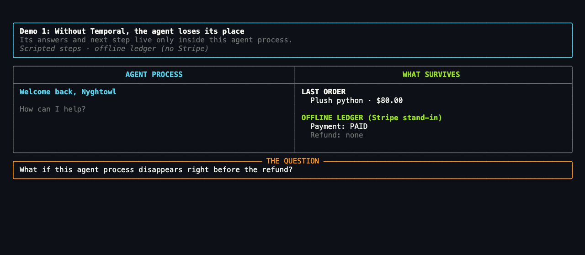
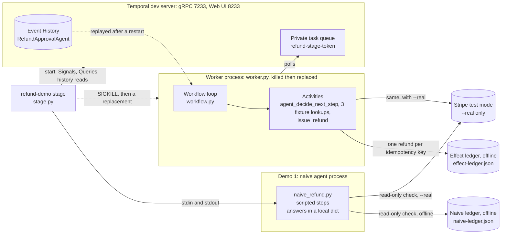
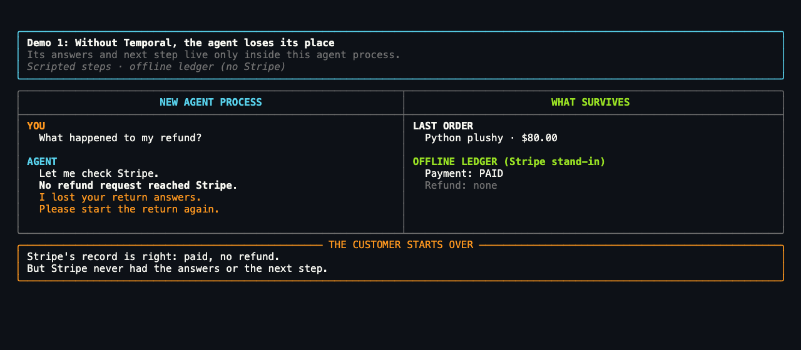
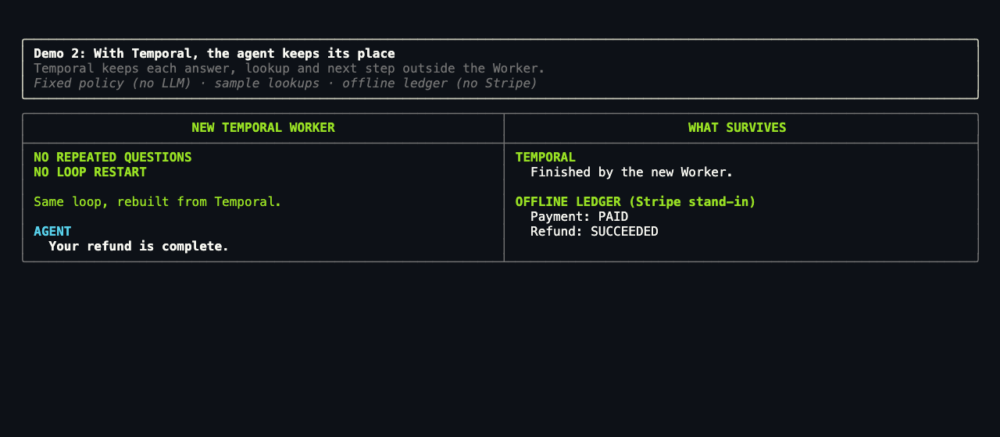

# Agent Memory and State

<div align="center">

[](LICENSE)
[](pyproject.toml)
[](https://github.com/temporalio/sdk-python)
[](https://docs.stripe.com/test-mode)
[](https://docs.astral.sh/uv/)

</div>

This repo shows what memory and execution state each do for an AI agent, and
Temporal's role: it keeps the execution state outside the agent's process. The
agent is a plain Python loop with no agent framework, so the boundary between
the two stays visible.

**What's covered:**

- [The demo](#see-the-idea-in-15-seconds): the naive agent and the
  Temporal-backed agent, side by side.
- [Memory and execution state](#memory-and-execution-state): what each one
  holds, and where to find it.
- [Temporal's role and limits](#what-this-demo-proves): Temporal keeps where
  the work stands; Stripe, not Temporal, says whether money moved.
- [Gotchas](#when-event-history-grows-claim-check-and-continue-as-new): Event
  History grows every turn; a claim check and continue-as-new keep it in bounds.
- [Cost to run](#cost-to-run): a measured GPT-5.6 Luna pass used 4 model calls,
  2,845 tokens, $0.0009. Starting over pays about that again (estimated);
  replay added 0 calls (measured).
- [Run the guided demo](#run-the-guided-demo): one command after setup; the
  default run needs no keys.
- [Takeaways](#takeaways): the three lines the demo ends on.

**What happens to an AI agent's in-flight work when its process dies?**

The demo kills a customer-support refund agent one step before it refunds
the customer. The failure mode is **lost loop position**. By then the agent has
asked the customer two questions, looked up the order and the customer's
refund history, and chosen `issue refund`. When the naive agent's process dies,
that progress is lost, and the new process has no way to get it back, so the
customer has to start the return again. The durable agent runs the same steps
as a Temporal Workflow. A new Worker rebuilds the loop from Event History and
resumes at `issue refund` without repeating a question.


**Last verified: 2026-10-01.** One offline `uv run refund-demo stage` run, in
which the Worker was killed at `issue refund` and the new Worker completed the
refund in the offline ledger; one `--real` run, in which the new Worker's refund
returned `succeeded` from Stripe test mode; one offline run each of
`--simulate-stripe-retry` and `--simulate-stripe-timeout`; and the offline tests
and lint. Not re-run on this date: the live-model pass, last measured on
2026-09-30 on GPT-5.6 Luna (offline ledger, 4 model calls, 2,845 tokens,
$0.0009). The Claude path has not been run.

**What is real and what is staged:**

- By default, the durable agent uses a deterministic refund policy, the naive
  agent is a scripted process, "Stripe" is an offline ledger, and Temporal is a
  local dev server. A default run makes no model calls: 0 tokens, $0.
- `--real` switches to Stripe test mode. `--real-model` lets Claude or OpenAI
  choose the lookups and the refund decision.
- The stage runner keeps its own copy of your Demo 1 answers for display and
  never gives it to the new agent process. It replays those answers into the
  durable run as Signals, so Demo 2 doesn't ask you to type them again, and the
  screen says so: "Reusing your Demo 1 answers so you don't type them twice..."
- Each demo's header has a dim line that names what is scripted, such as
  `Scripted steps · offline ledger (no Stripe)` or
  `Fixed policy (no LLM) · sample lookups · Stripe test mode`.
- On the default path, the durable Workflow waits on a stage-only `release`
  Signal just before the refund, so the Worker kill lands at the same point in
  every take.
- The kills are real: each process gets a SIGKILL.

## See the idea in 15 seconds



[Watch or download the MP4 version](assets/demo-reel.mp4), or
[view the presentation deck: *Agentic Memory and State* (PDF)](docs/agentic-memory-and-state.pdf).

| Moment | Naive agent | Durable agent |
| --- | --- | --- |
| **Before the request** | The customer's python plushy order shows as paid | The same paid order |
| **Agent loop** | A scripted process asks two questions, performs two lookups, and chooses `issue refund` | The same steps in a Temporal Workflow: answers are Signals, lookups are Activities |
| **Process killed** | The naive agent process takes the answers and loop position with it; Stripe still says paid with no refund | The Worker is killed; completed observations and the next action remain in Event History |
| **Agent reloads** | A new agent process correctly checks Stripe, but the customer starts over | A new Worker rebuilds the loop from Event History; **no repeated questions** |
| **Outcome** | The customer must repeat the intake | The loop resumes at `issue refund` |

## Videos

| Video | What it shows |
| --- | --- |
| **Temporal & AI Series: Agent Memory & State** (link added after publish) | An agent is killed one step before a refund. The naive agent loses the customer's answers; the durable loop resumes at `issue refund`. It also covers why Event History grows, and when to use a claim check or continue-as-new. |

Part of the **Temporal & AI Series** playlist (link added after publish).
Chapters: Hook · The problem · Demo · How memory and execution state relate ·
Where Temporal fits · Pros, cons, and gotchas · Cost to run · Takeaways and
resources. Timestamps are added after the final cut. The video's key moment is
written down in [The money moment](#the-money-moment), and the full cost is in
[Cost to run](#cost-to-run).

Links, the code as presented, and further reading are in
[Resources](#resources).

## Memory and execution state

An agent needs both, and they do different jobs.

| | What it helps with | In this demo | Where to find it |
| --- | --- | --- | --- |
| **Context** | What the model sees for this one decision | The refund request plus what's loaded from memory (the answers and lookups so far), sent on each turn | The input of each `agent_decide_next_step` Activity in Event History |
| **Memory** | What the agent knows or can look up, so it can reason | The customer's two answers and the lookups: order 1234 and the refund history of the demo customer, Nyghtowl | Naive agent: a dict inside its process (`naive_refund.py`). Durable agent: `working_memory` in the Workflow (`workflow.py`), rebuilt from history after a restart. On screen, lookups are marked `(memory)` |
| **Execution state** | Where the work stands: which steps finished and what runs next, so the work can continue after a crash without redoing it | 2 answers, 2 lookups, next action `issue refund` | Temporal: the Workflow's Event History in the Temporal UI (http://localhost:8233), or `uv run refund-demo inspect <workflow-id>` |
| **Effect state** | Whether the side effect really happened | Whether Stripe holds a refund for the payment | Stripe: the Dashboard in test mode, where the refund carries `temporal_workflow_id` (offline: the ledger) |

**Temporal's role.** Temporal keeps the execution state outside the agent's
process. Each finished step is recorded in Event History as it happens: an
answer arrives as a `customer_answer` Signal, and a model turn or a lookup
finishes as an Activity. When the Worker dies, a new Worker replays that
history, rebuilds the loop and `working_memory`, and continues at the next
unfinished step without calling the finished ones again. Temporal doesn't
decide what the agent does, doesn't make the model's answer right, and doesn't
make the refund exactly once; the Stripe idempotency key does that.

**Memory alone isn't enough.** A memory store could bring back the answers, but
not where the work stands: whether `issue refund` is next, already running, or
done. When two copies disagree, ask which record wins: Temporal for where the
work stands, Stripe for whether money moved. A durable job table or a careful
state machine can hold execution state too; in this demo, Temporal does.

The stage leads with the crash before the refund because the customer's cost is
visible; the [manual walkthrough](docs/REFUND_DEMO.md) covers the later loss,
after Stripe commits. A real system also has authorization state (may the agent
act?) and domain state (the business facts). Read
[Memory, state, and authority](docs/CONCEPTS.md) for the complete model,
including how one fact can play several roles, working and long-term memory,
the lifespan framing, and the exactly-once misconception.

## What this demo proves

**1. The agent is a plain loop.** It asks the customer two questions, looks up
the order and refund history, and decides. On the stage path, code asks the
two intake questions; a fixed policy or a live model picks the lookups and the
decision.

**2. Without execution state, a crash sends the customer back to the start.**
The naive agent keeps the answers and its place in the loop in process memory,
so when the process dies, both are gone. Stripe still correctly shows the
payment as paid with no refund (offline, a fixed `PAID` label and the naive
ledger stand in), but Stripe never had the answers or the next step. Saved
memory could bring back the answers, but not where the work stands. Your
options are to restart the loop or build your own durable state machine.

**3. With Temporal, the work picks up where it stopped.** The durable agent runs
the same loop as a Workflow, so each answer and lookup is recorded in Event
History. A new Worker rebuilds the loop from that history and continues at
`issue refund` without asking again. Because the app keeps the Workflow ID, it
can report the running or finished refund instead of starting a new one; on
the stage, the runner holds that handle for you.

**4. Temporal records the attempt; Stripe owns the outcome.** Durable execution
doesn't make the refund exactly once. Each run gets one idempotency key,
`durable-refund-` plus the SHA-256 of `<workflow_id>:<run_id>`, so every retry
in that run sends the same key, and Stripe returns the same refund instead of
creating a second one.

## How it works


```mermaid
flowchart LR
    accTitle: How the guided stage demo is wired
    accDescr: The refund-demo stage command drives both demos. Demo 1 is a scripted naive agent process that keeps its answers in memory, and after it is killed a new process only reads the effect owner. Demo 2 starts a Temporal Workflow on a local dev server. A separate Worker process polls a private task queue on that server and runs the Workflow loop and its Activities. The stage kills that Worker and starts a replacement, which replays Event History to rebuild the loop and then issues one refund to the offline effect ledger, or to Stripe test mode with --real.
    stage["refund-demo stage<br/>stage.py"]
    subgraph demo1["Demo 1: naive agent process"]
        naive["naive_refund.py<br/>scripted steps<br/>answers in a local dict"]
    end
    subgraph server["Temporal dev server: gRPC 7233, Web UI 8233"]
        queue["Private task queue<br/>refund-stage-token"]
        history[("Event History<br/>RefundApprovalAgent")]
    end
    subgraph worker["Worker process: worker.py, killed then replaced"]
        wf["Workflow loop<br/>workflow.py"]
        acts["Activities<br/>agent_decide_next_step, 3 fixture lookups,<br/>issue_refund"]
    end
    naiveLedger[("Naive ledger, offline<br/>naive-ledger.json")]
    effectLedger[("Effect ledger, offline<br/>effect-ledger.json")]
    stripe[("Stripe test mode<br/>--real only")]
    stage -->|"stdin and stdout"| naive
    naive -->|"read-only check, offline"| naiveLedger
    naive -->|"read-only check, --real"| stripe
    stage -->|"start, Signals, Queries, history reads"| server
    worker -->|"polls"| queue
    history -.->|"replayed after a restart"| wf
    wf --> acts
    acts -->|"one refund per idempotency key"| effectLedger
    acts -->|"same, with --real"| stripe
    stage -.->|"SIGKILL, then a replacement"| worker
```

`uv run refund-demo stage` ([`stage.py`](src/refund_agent/stage.py)) drives a
scripted naive subprocess ([`naive_refund.py`](src/refund_agent/naive_refund.py))
for Demo 1 and the `RefundApprovalAgent` Workflow for Demo 2. A separate Worker
([`worker.py`](src/refund_agent/worker.py)) polls a private
`refund-stage-<token>` task queue and runs the loop
([`workflow.py`](src/refund_agent/workflow.py)) and its Activities. The stage
SIGKILLs it at `ready_to_refund`; a replacement replays Event History and
issues one refund ([full walkthrough](docs/ARCHITECTURE.md#how-the-stage-is-wired)).

### The agent loop is ordinary Python

Condensed from [`workflow.py`](src/refund_agent/workflow.py):

```python
for turn in range(MAX_TURNS):  # MAX_TURNS = 10
    step = await workflow.execute_activity(
        agent_decide_next_step,
        args=[request, self.working_memory],
        summary=f"Agent turn {turn + 1}: decide the next step",
    )  # plus a timeout and retry policy
    if step.action == "decide":
        decision = RefundDecision(...)
        break
    if step.action == "ask_customer":
        await workflow.wait_condition(answer_arrived)  # customer_answer Signal
        self.working_memory.append(customer_answer)
        continue
    result = await self._run_tool(step.tool, request)
    self.working_memory.append({"tool": step.tool, "result": result})
# After the approval and release waits:
return await workflow.execute_activity(issue_refund, ...)
```

Answers arrive as Signals, every external call is an Activity, and a
replacement Worker rebuilds `working_memory` by replaying Event History. The
[full sketch](docs/ARCHITECTURE.md#the-agent-loop-is-ordinary-python) adds
timeouts, retry policies, and a side-by-side with a plain in-process loop.

**Temporal owns retries.** The Anthropic and OpenAI clients are built with
`max_retries=0`, because both SDKs otherwise retry inside the call, where
Temporal can't see it. A 429, a 5xx, a connection error, or the 45-second client
timeout fails that `agent_decide_next_step` attempt, and its retry policy (up to
5 attempts per model turn, each inside a 60-second Activity timeout) tries
again. Temporal Web shows the attempt count and last failure. Other 4xx errors
fail the turn without a retry. The Stripe calls also set
`max_network_retries = 0`. The refund call allows 3 seconds to connect and 10
seconds of silence from Stripe while reading, and `issue_refund` heartbeats
while it waits, so a slow call is not taken for a lost Worker. A timeout, a
connection error, a 409, a 429, or a 5xx fails that attempt, and the next
attempt reuses the same idempotency key, after Stripe's `Retry-After` wait if
it sent one. Other 4xx errors fail the refund without a retry, and a
`Stripe-Should-Retry` header overrides either choice.

## Run the guided demo

Prerequisites: Python 3.11 or newer, the
[Temporal CLI](https://docs.temporal.io/cli) (tested 1.6.2), and
[uv](https://docs.astral.sh/uv/) (tested 0.11.8).
Install the project, test tools, and Rich terminal UI, then create `.env` from
the example without overwriting one you already have:

```bash
git clone https://github.com/temporal-community/temporal-ai-agent-memory-state-stripe.git
cd temporal-ai-agent-memory-state-stripe
uv sync --extra dev --extra tui
test -e .env || cp .env.example .env
```

The default run needs no keys. Fill in `.env` only for `--real` or
`--real-model`. Exported shell variables take precedence over `.env`.

Run the complete comparison in one fullscreen terminal, pressing Enter at each
prompt:

```bash
uv run refund-demo stage
```

### Make targets

The Makefile wraps the same commands. `make` alone lists the targets, and
`make -n <target>` prints a target's command without running it.

| Target | Runs | Notes |
| --- | --- | --- |
| `make setup` | `uv sync --extra dev --extra tui` | Keeps both extras; a plain `uv sync` removes the Rich stage view |
| `make run` | `uv run refund-demo stage` | The key-free path: fixed policy, offline ledger, 0 model calls |
| `make run-real` | `uv run refund-demo stage --real` | Needs a Stripe `sk_test_` or `rk_test_` key; creates Stripe test objects |
| `make failure` | `uv run refund-demo stage --simulate-stripe-timeout` | Offline. The Worker is killed while `issue_refund` is in flight, and a new Worker runs attempt 2 |
| `make reset` | `uv run refund-demo cleanup`, then prints the manual reset steps | Refunds only leftover demo test payments, and only with a Stripe test key. Deletes and stops nothing |
| `make test` | `uv run --extra dev pytest -q` | Offline |
| `make lint` | `uv run --extra dev ruff check .` and `uv run --extra dev ruff format --check .` | Offline |
| `make usage` | `uv run refund-demo usage` | Sums a pass logged with `LOG_MODEL_USAGE=1`, or names the newest stage log |

### Choose the stage path

| Goal | Command | Model tokens and dollars per pass |
| --- | --- | --- |
| Rehearse safely with deterministic responses and an offline ledger | `uv run refund-demo stage` | 0 tokens, $0 |
| Run the same story against Stripe test mode | `uv run refund-demo stage --real` | 0 tokens, $0 |
| Show a real Activity retry after a simulated Stripe timeout | `uv run refund-demo stage --real --simulate-stripe-timeout` | 0 tokens, $0 |
| Let a live model choose the lookups and the decision | `uv run refund-demo stage --real-model --model-provider anthropic` (or `openai`) | GPT-5.6 Luna, measured 2026-09-30: 4 calls, 2,845 tokens (reasoning included), $0.0009. Claude Sonnet 4.6, estimated (not run): about 4 calls, 5,600-7,300 tokens, about $0.02-$0.03. See [Cost to run](#cost-to-run) |

A live model needs `ANTHROPIC_API_KEY` and `ANTHROPIC_MODEL`, or
`OPENAI_API_KEY` and `OPENAI_MODEL`; set `OPENAI_MODEL=gpt-5.6-luna` to match
the measured pass. `--real` needs a Stripe `sk_test_` or
`rk_test_` key; live Stripe keys are rejected. If a `--real` take ends before
the refund, run `uv run refund-demo cleanup`. The
[guided stage runner](docs/STAGE_GUIDE.md) covers each step, the timeout and
`--simulate-stripe-retry` paths, and live-model tips.

### Watch it in Temporal Web

Start `temporal server start-dev` in another terminal first. The stage reuses
it, so Temporal Web at <http://localhost:8233> stays up after the stage exits; a
server the stage starts shuts down with it. Pass a new `--workflow-id` for each
take, such as `nyghtowl-take-01`. The [Temporal Web guide](docs/TEMPORAL_WEB.md)
covers what to check at each frame, the port variant when 7233 or 8233 is
taken, CLI commands, and resetting between takes.

## Put it under real conditions

The failure is a Temporal Worker that dies mid-loop. The default stage run
sends it a real SIGKILL one step before the refund. With your own dev server
running (see above), watch it at <http://localhost:8233>:

1. When Demo 2's agent loop shows `→ Next: issue refund` and the stage waits
   for Enter, the Worker is still alive. Open the Workflow's Queries tab and
   run `stage_progress`. It returns `phase: "ready_to_refund"`, two
   `customer_answer` entries, and both lookup results.
2. After the kill (`WORKER GONE`), open the History tab. The Workflow is still
   `Running`, with the two answers and completed lookups, no `issue_refund`, and
   no pending Activity. Don't run a Query now: Queries need a live Worker.
3. After recovery, the Workflow is `Completed`. No `agent_decide_next_step`,
   lookup, or `customer_answer` event repeats, and one `issue_refund` ran at
   attempt 1.

The [Temporal Web guide](docs/TEMPORAL_WEB.md#what-to-check-at-each-frame) has
the full event list for each step.

To kill the Worker while the refund Activity is in flight instead, run
`make failure`, or the command it runs. Attempt 1 enters `issue_refund`, the
simulated Stripe API doesn't respond, and the Worker is killed before any
refund is accepted. A new Worker runs attempt 2 with the same idempotency key.
It runs offline with no model calls (0 tokens, $0):

```bash
uv run refund-demo stage --simulate-stripe-timeout
```

## The money moment

Both agents hit the same failure at the same point in the loop, with two
different outcomes. The naive agent process is killed after choosing
`issue refund` (`PROCESS GONE`). The new agent process tells the customer: "No
refund request reached Stripe. I lost your return answers. Please start the
return again."

The durable Worker is killed at the same next action. With no Worker running,
Temporal still has both answers, both lookups, and
`Next action: issue refund`, and the stage reads them back from Event History
on the `WORKER GONE` frame ([shown at the top](#agent-memory-and-state)). The
new Worker finishes with `NO REPEATED QUESTIONS`, `NO LOOP RESTART`, and "Your
refund is complete."

In the video: "Memory helps reasoning continue. Temporal helps the operation
continue."

For proof beyond the stage screen, [Temporal Web](docs/TEMPORAL_WEB.md#what-to-check-at-each-frame)
shows the Workflow still Running during `WORKER GONE` and no repeated
`agent_decide_next_step`, lookup, or `customer_answer` event after the
restart. There, the `issue_refund` `ActivityTaskStarted` event shows the new
Worker's identity: `<pid>@refund-demo` with a new PID. If `TEMPORAL_IDENTITY`
is set, that value is used verbatim, so both Workers show it. With `--real`,
the ledger pane's heading reads `STRIPE (test mode)`, and the Stripe Dashboard
shows one refund on the payment, with `temporal_workflow_id` and
`temporal_idempotency_key` in its metadata.

The naive answer is not wrong: memory and Stripe are both useful. The contrast
is whether the autonomous work itself still has a position:

| Process-local loop | Durable execution |
| --- | --- |
| The answers and active loop disappear; Stripe only says paid with no refund. | Temporal retains completed observations and `Next action: issue refund`; the new Worker continues without repeating questions. |
|  |  |

## What you should see

Key lines from a default run, in order (box drawing and most lines removed):

```text
Demo 1: Without Temporal, the agent loses its place
    → Next: issue refund
  AGENT PROCESS  PROCESS GONE
  AGENT  No refund request reached Stripe.
         Please start the return again.
Demo 2: With Temporal, the agent keeps its place
  TEMPORAL WORKER  WORKER GONE
  WHAT SURVIVES    TEMPORAL  Read from Temporal just now:
                             Next action: issue refund
  NEW TEMPORAL WORKER  NO REPEATED QUESTIONS
                       NO LOOP RESTART
                         Your refund is complete.
```

The [expected output](docs/EXPECTED_OUTPUT.md) has the full transcript, the
pane text when the history read fails, and the Worker log showing the resume.

## Cost to run

A live-model pass on GPT-5.6 Luna, measured on 2026-09-30, made 4 model calls:
2,492 input and 353 output tokens (114 of them reasoning), 2,845 tokens in all,
$0.0009 at the 2026-09-29 list prices. Claude Sonnet 4.6 has not been run; it
is an estimated 4 model calls, about 5,400-6,900 input and 200-400 output
tokens, about $0.02-$0.03.

Starting the loop over from scratch after the kill pays about the same again:
about 4 calls and 2,845 tokens, $0.0009, on Luna. That is an estimate, because
Demo 1's scripted agent calls no model. In the measured pass, Temporal replay
made 0 extra model calls: the new Worker read the recorded model turns from
Event History. A model call still running when a Worker dies is different: it
runs again after its 60-second Activity timeout and can be billed again. On
the stage path the kill lands after the last model call, so no call is in
flight.

The offline rehearsal (`uv run refund-demo stage`) and the `--real` run use a
fixed policy: 0 model calls, 0 tokens, $0.

| Run | Model and settings | Model calls per pass | Tokens per pass | Dollars per pass | Basis |
| --- | --- | --- | --- | --- | --- |
| `uv run refund-demo stage --real-model --model-provider openai` | `gpt-5.6-luna`, Responses API, reasoning effort left at the model default, no output cap | 4 (all before the kill; the kill + replay added 0) | 2,845: 2,492 input (0 cached) + 353 output (239 visible + 114 reasoning, billed as output) | $0.0009 | **Measured**, 2026-09-30, one pass with `LOG_MODEL_USAGE=1`, summed by `refund-demo usage` |
| `uv run refund-demo stage --real-model --model-provider anthropic` | `claude-sonnet-4-6`, `max_tokens=512`, forced tool choice, no extended thinking, no prompt caching | about 4 (the 2 intake questions don't call the model) | about 5,400-6,900 input + 200-400 output | about $0.02-$0.03 | **Estimated**, 2026-09-29. Not run: no Claude pass has been logged |
| Start over from scratch after the kill, instead of replaying | Same model and settings as the pass | about 4 more | about 2,845 more on Luna; about 5,600-7,300 more on Claude | about $0.0009 more on Luna; about $0.02-$0.03 more on Claude | **Estimated**: the measured pass repeated. Not measured, because Demo 1 calls no model |
| Worst case, stage with Claude | 8 model turns x 5 Temporal attempts; assumes about 2,000 input tokens per call (default request text) and every call billed at the 512-token cap | 40 | about 80,000 input + 20,480 output | about $0.55 | Modeled from the code. Not a hard ceiling: your request text is resent on every call |
| Worst case, manual `refund-demo start` with Claude | 10 model turns x 5 attempts (no code-driven intake turns); same assumptions | 50 | about 100,000 input + 25,600 output | about $0.68 | Modeled from the code, same caveat |
| Worst case, stage with GPT-5.6 Luna | 8 turns x 5 attempts; assumes about 2,000 input and about 2,100 output plus reasoning tokens per call | 40 | about 80,000 input + 84,000 output | about $0.12 | Modeled. No fixed ceiling: the code sets no output cap |
| `uv run refund-demo stage` | None: deterministic policy, offline ledger, local dev server | 0 | 0 | $0.00 | From the code path |
| `uv run refund-demo stage --real` | None: deterministic policy, Stripe test mode | 0 | 0 | $0.00 (Stripe test mode moves no money) | From the code path |

List prices as of 2026-09-29, per million tokens: Claude Sonnet 4.6 $3 input
and $15 output; GPT-5.6 Luna $0.20 input and $1.20 output. Stripe test mode and
the local dev server cost $0; on Temporal Cloud a pass is an estimated 20-165
Actions, under one cent. Retries (up to 5 attempts per model turn), more turns,
a longer request resent on every call, and reasoning tokens raise the cost.
[Cost methodology](docs/COST.md) has the price sources, each cost driver, how
the measurement and estimates were made, and how to log and sum a pass's
tokens and dollars with `LOG_MODEL_USAGE=1` and `refund-demo usage`.

<!-- After a measured Claude pass, replace the "Estimated" Claude row with the
measured calls, tokens, dollars, and date. -->

## When Event History grows: claim check and continue-as-new

Event History records every Activity's input and result; that record is how
the replacement Worker resumes. This loop resends all of `working_memory` to
`agent_decide_next_step` each turn, so recorded bytes grow with the square of the turn
count. The demo stays under 7 KB of payloads (it stops at `MAX_TURNS = 10`),
but a payload-only model with 20 KiB tool results and no turn cap crosses 4 MiB
around turn 20, the 10 MiB warning around turn 32, and the 50 MiB limit around
turn 72, still under 1,000 events. Bytes reach the limits before the event
count does. The model input grows the same way: the turn-70 model call alone
sends about 350K input tokens, about $1.06 on Claude Sonnet 4.6 at the
2026-09-29 list price of $3 per million input tokens (an estimate: payload
bytes only, about 4 bytes per token, uncached). Keep small observations in
Workflow state, large records in a memory store behind a key (a claim check;
the Python SDK's External Storage), and roll a long loop over with
continue-as-new.

**Measured in the fleet demo.** The companion
[fleet demo](https://github.com/temporal-community/temporal-ai-hitl-adk-langgraph)
ran one full pass per tab on 2026-09-30. On the Human → Agent tab, with the
model calls inline, the parent Workflow ended at 4,947 events and 9,443,220
bytes (9.0 MiB), about 1 MiB under the 10 MiB warning. On the Cross-Framework
tab, with the model calls in child Workflows, the parent ended at 2,154 events
and 408,054 bytes (0.4 MiB).

The fleet rolls each driver Workflow over at 10,000 events, at a quiet point
when the driver is idle with nothing pending
([continue-as-new code](https://github.com/temporal-community/temporal-ai-hitl-adk-langgraph/blob/as-presented-2026-07/agent_fleet/workflows.py#L390-L414)).
The parent has the same guard, but a pass ends before it fires. Both count
events, not bytes. The inline parent reached 9.0 MiB at 4,947 events, so on a
longer run it would pass the 10 MiB warning long before 10,000 events.

On the Agent → Human tab, one full pass (51 orders) made 322 model calls and
used 732,256 tokens, $1.49, on `gemini-3.8-flash` with its default (medium)
thinking, at list prices valid through 2026-12-31. That leaves out 51 venue
searches, also Gemini calls, whose tokens LangGraph doesn't keep. On main, the
fleet README's
[history note](https://github.com/temporal-community/temporal-ai-hitl-adk-langgraph/blob/main/README.md#what-this-is-not)
gives these sizes rounded in MB, and its
[Cost to run](https://github.com/temporal-community/temporal-ai-hitl-adk-langgraph/blob/main/README.md#cost-to-run)
has every tab and what changes the cost.

| Threshold | History size | Events | What happens |
| --- | --- | --- | --- |
| Continue-as-new suggested | 4 MiB | 4,096 | `workflow.info().is_continue_as_new_suggested()` returns `True`. Nothing is enforced. Python Workflow code gets only a yes/no, not a reason. |
| Warning | 10 MiB | 10,240 | The server logs warnings. |
| Limit | 50 MiB | 51,200 | The Workflow Execution is terminated. |
| One payload | 2 MB. The warning comes at a few hundred KB; the docs list both 256 KB and 512 KB | n/a | A payload the Workflow produces fails the Workflow Task, and on Python SDK 1.23+ the run stays open until you deploy a fix. An oversized Activity result fails that Activity attempt instead. The SDK enforces this only when the server reports its limits at Worker start. |

Temporal server defaults, per the
[Event History limits](https://docs.temporal.io/workflow-execution/event#event-history-limits).
The [deep dive](docs/HISTORY_GROWTH.md) covers seeing growth in Temporal Web,
both fixes and their pitfalls, Temporal Cloud limits, and all sources.
The demo doesn't run continue-as-new; [what it looks like](docs/HISTORY_GROWTH.md#what-continue-as-new-looks-like-sketch) shows a sketch and its captured two-run Event History.

## How other products approach it

| Kind | Examples | After a crash |
| --- | --- | --- |
| Memory layers and transcript stores | Mem0, Letta, Anthropic memory tool, OpenAI Agents SDK Sessions | Restore what the agent knows; a new process decides again |
| Execution state inside one agent runtime | LangGraph checkpointers, LangSmith Deployment, OpenAI Agents SDK `RunState`, Google ADK Resume | Resume within that runtime; some re-run a step, so effects still need idempotency keys |
| Execution state you build | Postgres job table with a recovery point | A completer process you write |
| Durable execution, not tied to an agent framework | Temporal (this demo), DBOS | Resume from recorded steps: any Temporal Worker polling the task queue, or the DBOS app from its last completed step |

Persisted chat history lets a new process decide again. Durable execution
resumes the decision the agent already made. And Stripe, not either of them,
says whether money moved. The [full comparison](docs/COMPARISON.md) has each
product's details and sources as read on 2026-09-29, and when you don't need
Temporal.

## What it is not

- **Not a production refund service.** No authentication, production database,
  web application, multi-agent orchestration, or operational hardening.
- **Not LLM-driven by default.** Without `--real-model`, a deterministic policy
  decides. With it, code still asks the two intake questions, the model chooses
  the lookups and the decision, and the stage approves if the model escalates.
- **The naive side is not a model or a Temporal Worker.** It is a scripted
  process with hard-coded questions and lookups: the same steps as the durable
  half, not the same code. The screens call it the agent process
  (`PROCESS GONE`, `NEW AGENT PROCESS`) and keep "Worker" for the Temporal
  side (`WORKER GONE`, `NEW TEMPORAL WORKER`).
- **The lookups return fixtures.** `lookup_order`, `lookup_customer_history`,
  and `check_refund_policy` return fixed records.
- **It does not show an application recovering its own Workflow ID.** The stage
  runner replays your Demo 1 answers as Signals and holds the Workflow handle
  throughout, so what you see is a Worker being replaced. A real application
  must keep or derive the Workflow ID and surface the Workflow's status.
- **The pause before the refund is staged.** On the default path, the Workflow
  waits on a stage-only `release` Signal at `ready_to_refund`, so the kill lands
  at the same point every time; a real Worker dies wherever it dies.
  `--simulate-stripe-timeout` kills it while `issue_refund` is in flight.
- **Not every Stripe line is a live Stripe read.** `Payment: PAID` in the
  durable pane, and in the naive pane before the kill, is a fixed label. The
  durable refund line reads a local mirror of Stripe's response. Only the new
  agent process's status check reads Stripe directly, and only with `--real`;
  offline, it reads its own naive ledger. In the default mode the pane heading
  says `OFFLINE LEDGER (Stripe stand-in)` (with `--real`, `STRIPE (test mode)`),
  but the agent's lines and the Worker log still say "Stripe" as the story's
  name for the effect owner.
- **Not a memory system.** Temporal holds execution state, not the agent's
  memory, and [Event History is bounded](#when-event-history-grows-claim-check-and-continue-as-new).
  The demo doesn't prescribe how agent memory should be stored or managed;
  where durable execution and long-term memory best fit together is an open
  design question.
- **Not exactly-once.** One request can mean two calls and still one refund,
  because both calls share one idempotency key.
- **Not Temporal Cloud.** The clients connect to a local dev server, with no TLS
  or API-key options.

**Trade-offs.** You may not need Temporal when only the conversation matters,
when your runtime already keeps execution state, or for a short, fixed pipeline
on a job table
([when you don't need Temporal](docs/COMPARISON.md#when-you-dont-need-temporal)).
Event History holds customer data, such as the customer's answers and every
Activity's input and result, so plan its retention and add an encryption codec.
You also have to run a Temporal service or use Temporal Cloud.

## Troubleshooting

Stage errors are printed as `STAGE | <message>`. Workflow and Activity failures
show up in Temporal Web and in `.demo-state/stage-<token>/worker.log`. The five
most likely errors are below; the [full troubleshooting table](docs/TROUBLESHOOTING.md)
covers live-model, Stripe, timeout, usage-log, and Temporal Web errors.

| You see | Cause | Fix |
| --- | --- | --- |
| ``STAGE \| Temporal is not reachable and the `temporal` CLI is not on PATH`` | Nothing answers at `TEMPORAL_ADDRESS`, and the stage can't start a server | Install the Temporal CLI, or run `temporal server start-dev` first |
| `STAGE \| Temporal dev server exited while starting:` plus a log tail | Usually port 7233 or 8233 is already in use | Use the [port variant](docs/TEMPORAL_WEB.md#start-your-own-dev-server) |
| `STAGE \| Worker exited while starting:` plus a log tail | Often a live or malformed `STRIPE_API_KEY` in `.env`, rejected even offline | Read the tail. Use a `sk_test_` or `rk_test_` key, or remove it |
| `The stage view needs rich. Install it with: uv sync --extra tui` | A plain `uv sync` removed the optional Rich extra | Run `uv sync --extra dev --extra tui` |
| `WorkflowAlreadyStartedError` traceback | You reused a running take's `--workflow-id` | Use a new ID, or run `uv run refund-demo stop <id>` |

## Explore the demos

| Guide | Use it for |
| --- | --- |
| [Ten-minute talk run of show](docs/TALK_10_MIN.md) | Timed speaker notes, stage cues, fallbacks, and a rehearsal scorecard |
| [Memory, state, and authority](docs/CONCEPTS.md) | The conceptual boundary and system-of-record model |
| [Manual refund demo](docs/REFUND_DEMO.md) | Multi-terminal setup, uncertain-effect beat, replay case, Stripe mode, and event history |
| [Permission state demo](docs/PERMISSION_DEMO.md) | Why remembered authorization is not current authorization |
| [Guided stage runner](docs/STAGE_GUIDE.md) | Each stage step, the simulation flags, live models, and `--real` cleanup |
| [Watch it in Temporal Web](docs/TEMPORAL_WEB.md) | Your own dev server, the port variant, what to check at each frame, and resetting between takes |
| [Expected output](docs/EXPECTED_OUTPUT.md) | The full stage transcript and Worker log |
| [Cost methodology](docs/COST.md) | Price basis, cost drivers, estimation method, and measuring tokens and dollars yourself |
| [When Event History grows](docs/HISTORY_GROWTH.md) | History growth, limits, claim check, External Storage, and continue-as-new |
| [How other products approach it](docs/COMPARISON.md) | The full product comparison with sources, and when you don't need Temporal |
| [Troubleshooting](docs/TROUBLESHOOTING.md) | Every error string, its cause, and its fix |
| [Architecture and code tour](docs/ARCHITECTURE.md) | The diagram walkthrough, full loop sketch, useful commands, repository map, and tests |

Every command entry point is in [Useful commands](docs/ARCHITECTURE.md#useful-commands);
run the tests with `uv run --extra dev pytest -q`.

## Takeaways

The demo ends on these, in the stage's closing frame:

- **Without Temporal, the customer had to start over.** The agent's answers
  and next step lived only in its process, and they died with it.
- **With Temporal, a new Worker picked up at the saved next action,**
  `issue refund`, without asking the customer again.
- **Memory helps reasoning continue. Temporal helps the operation continue.**
  Stripe, not either of them, knows whether money moved.

And two things to keep in mind when you build your own:

- **Durable execution can run a step more than once.** Give every side effect
  an idempotency key that the receiving system checks, as the refund does
  here.
- **A crash that starts over pays for the model calls again.** Replaying from
  Event History doesn't; only a call in flight at the crash can bill twice.

## Resources

- **The video** and the **Temporal & AI Series** playlist: links added after
  publish.
- **As presented.** The September 2026 talk ran the code tagged
  [`as-presented-2026-09`](https://github.com/temporal-community/temporal-ai-agent-memory-state-stripe/tree/as-presented-2026-09).
  `main` keeps moving; link the tag when you cite the talk.
- **Further reading:** [Temporal docs](https://docs.temporal.io), the
  [Python SDK](https://github.com/temporalio/sdk-python), and
  [Stripe idempotent requests](https://docs.stripe.com/api/idempotent_requests).

<!-- TODO before publishing: video URL with UTM and the Temporal & AI Series
playlist URL (here and in Videos), related videos (human-in-the-loop,
multi-agent handoffs), the blog post URL if there is one, and Temporal Cloud
credits when available. -->

## Acknowledgments

Thanks to Cecil for the review that shaped how this repository frames memory
and state.

## License

Released under the [MIT License](LICENSE).
