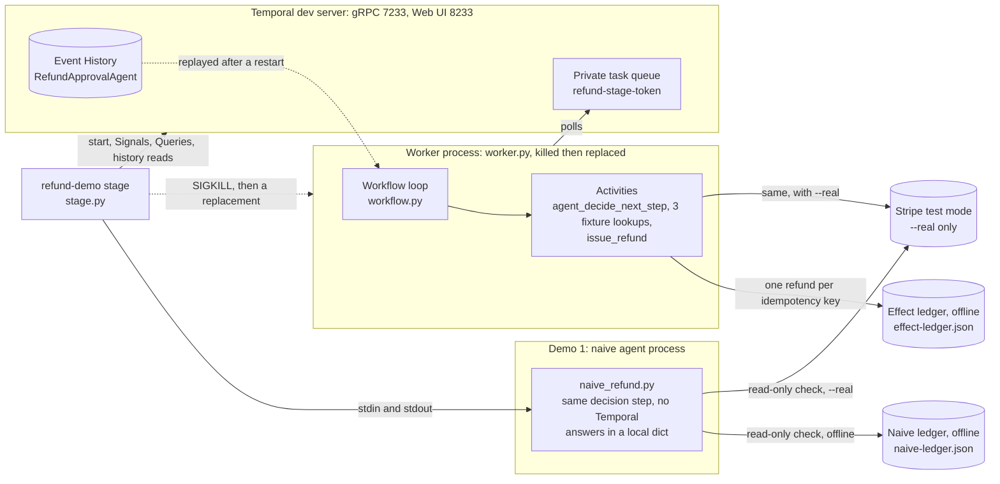

# Architecture and code tour

Back to the [README](../README.md). This page holds the wiring diagram and its
walkthrough, the full loop sketch, how retries work, every command entry point,
the repository map, and the test commands.

## How the stage is wired



`uv run refund-demo stage`
([`src/refund_agent/stage.py`](../src/refund_agent/stage.py)) is the only command
you run.

For Demo 1, it launches a naive agent subprocess
([`naive_refund.py`](../src/refund_agent/naive_refund.py)) and talks to it over
stdin and stdout. The subprocess runs the same loop as Demo 2, in process: each
turn calls `decide_next_step`, the function behind the `agent_decide_next_step`
Activity, so it uses the fixed policy by default and the live model with
`--real-model`. It keeps the customer's answers in a local dict and its
observations in a local list. After it is killed, a new subprocess only reads
the effect owner. Offline, that is its own `naive-ledger.json`; with `--real`,
it retrieves the PaymentIntent and its refund list from Stripe test mode.

For Demo 2, the stage connects to a Temporal dev server at `localhost:7233`, or
starts one. It starts the `RefundApprovalAgent` Workflow, sends
`customer_answer` and `release` Signals, and polls the `stage_progress` Query
while a Worker runs. It also reads Event History for each durable frame; the
`WORKER GONE` frame takes its counts from that history, because no Worker is
running to answer a Query.

A separate Worker subprocess ([`worker.py`](../src/refund_agent/worker.py)) polls
a private task queue, `refund-stage-<token>`. It runs the Workflow loop
([`workflow.py`](../src/refund_agent/workflow.py)) and its Activities:

- `agent_decide_next_step`: a deterministic policy by default, or Claude or
  OpenAI with `--real-model`. Each call carries the summary
  `Agent turn N: decide the next step`, shown in Event History
- three fixture lookups: `lookup_order`, `lookup_customer_history`, and
  `check_refund_policy`, with the summaries `Look up order 1234`,
  `Look up the customer's refund history`, and `Check the refund policy`
- `issue_refund`, summary `Issue the refund in Stripe`, which writes one
  refund keyed by
  `durable-refund-<sha256 of workflow_id:run_id>`. Offline, it writes to
  `effect-ledger.json`, a different file from the naive ledger; with `--real`,
  it calls Stripe test mode.

The stage SIGKILLs that Worker while the Workflow waits at `ready_to_refund`,
then starts a replacement. The replacement rebuilds the loop by replaying Event
History.

## The agent loop is ordinary Python

The production Workflow lives in
[`src/refund_agent/workflow.py`](../src/refund_agent/workflow.py). This condensed
sketch shows the loop:

```python
decision: RefundDecision | None = None

for turn in range(MAX_TURNS):  # MAX_TURNS = 10
    step = await workflow.execute_activity(
        agent_decide_next_step,
        args=[request, self.working_memory],
        start_to_close_timeout=timedelta(seconds=60),
        retry_policy=_MODEL_RETRY,  # up to 5 attempts per model turn
        summary=f"Agent turn {turn + 1}: decide the next step",
    )

    if step.action == "decide":
        decision = RefundDecision(
            recommendation=step.recommendation or "escalate",
            rationale=step.rationale or "",
            source=step.source,
        )
        break

    if step.action == "ask_customer":
        await workflow.wait_condition(answer_arrived)  # customer_answer Signal
        self.working_memory.append(customer_answer)
        continue

    result = await self._run_tool(step.tool, request)
    self.working_memory.append({"tool": step.tool, "result": result})

if decision is None:
    raise ApplicationError(
        "agent did not reach a decision within the turn budget",
        type="AgentLoopExhausted",
        non_retryable=True,
    )

if decision.recommendation == "deny":
    return RefundResult(...)

if decision.recommendation != "approve":
    await workflow.wait_condition(lambda: self.approved)  # approve Signal

if request.hold_before_effect:
    # Stage only: park at the next action so the Worker kill lands at the
    # same point every time. The stage sends `release` after the restart.
    await workflow.wait_condition(lambda: self.released)

# 15 s heartbeat; issue_refund heartbeats while it waits on Stripe. Only the
# stage's --simulate-stripe-* runs use 3 s. Stage runs get a 6 min
# start-to-close, others 1 min.
heartbeat_timeout, start_to_close_timeout = refund_activity_timeouts(request)
return await workflow.execute_activity(
    issue_refund,
    args=[request, decision, self.working_memory],
    heartbeat_timeout=heartbeat_timeout,
    start_to_close_timeout=start_to_close_timeout,
    schedule_to_close_timeout=timedelta(minutes=10),
    retry_policy=RetryPolicy(maximum_attempts=10, ...),
)
```

On the stage path, the two intake questions are asked by code before any model
or policy step (`refund-demo start` leaves them off). The model, or the
deterministic policy, chooses the lookups and the decision. The loop is
bounded, Workflow state replays deterministically, and every external call runs
as an Activity.

The change from a plain in-process loop is small. Demo 1's naive process
(`_run_interactive_agent_loop` in `naive_refund.py`) is the left column:

| Plain in-process loop | Temporal Workflow loop |
| --- | --- |
| `step = decide_next_step(request, working_memory)` | `step = await workflow.execute_activity(agent_decide_next_step, args=[request, self.working_memory], ...)` |
| `answer = sys.stdin.readline()` | A `customer_answer` Signal, then `await workflow.wait_condition(...)` |
| `working_memory.append(result)`, held in RAM | `self.working_memory.append(result)`, rebuilt by replay after a restart |

## Temporal owns retries

No client retries on its own. Every retry is a Temporal Activity attempt, so
Temporal Web shows the attempt count and the last failure.

**Model calls.** The Anthropic and OpenAI clients are built with
`max_retries=0`, because both SDKs otherwise retry inside the call, where
Temporal can't see it. A 429, a 5xx, a connection error, or the 45-second client
timeout fails that `agent_decide_next_step` attempt. Its retry policy then tries
again: up to 5 attempts per model turn, each inside a 60-second Activity
timeout. Other 4xx errors fail the turn without a retry.

**Stripe calls.** The Stripe client sets `max_network_retries = 0`. The refund
call allows 3 seconds to connect and 10 seconds of silence from Stripe while
reading. `issue_refund` heartbeats every second while it waits, so a slow call
is not taken for a lost Worker. A timeout, a dropped connection, a 409, a 429,
or a 5xx fails that attempt. (Stripe returns 409 while an earlier call with the
same idempotency key is still running.) The next attempt reuses the same
idempotency key, after Stripe's `Retry-After` wait if it sent one of 60 seconds
or less. Other 4xx errors fail the refund without a retry, and a
`Stripe-Should-Retry` header overrides either choice.

[Troubleshooting](TROUBLESHOOTING.md) lists the failure messages these paths
print and what to do about each.

## Useful commands

| Command | Purpose |
| --- | --- |
| `uv run refund-demo stage` | Run the recommended one-window talk path |
| `uv run naive-refund` | Explore the uncoordinated agent interactively |
| `uv run refund-worker` | Start the Temporal Worker for manual runs |
| `uv run refund-demo watch <id>` | Watch context and memory beside authoritative state |
| `uv run refund-demo inspect <id>` | Inspect a Workflow and its effect calls |
| `uv run refund-demo usage --state-dir <path>` | Sum a run's logged model tokens and dollars (needs `LOG_MODEL_USAGE=1`) |
| `uv run permission-chat --panes` | Run the authorization companion demo |

## Repository map

```text
src/refund_agent/workflow.py       durable agent loop and Signals
src/refund_agent/activities.py     model, tool, and refund side effects
src/refund_agent/stage.py          guided one-window talk runner
src/refund_agent/tui.py            stage panels and the Event History read
src/refund_agent/naive_refund.py   uncoordinated comparison
src/refund_agent/fake_stripe.py    offline effect ledger
src/refund_agent/permission_chat.py authorization-state companion
assets/                            generated demo reel and screenshots
docs/                              concepts, talk notes, and detailed demo guides
tests/                             agent, effect, stage, and settings tests
```

## Tests and visual assets

```bash
uv run --extra dev pytest -q
uv run --extra dev ruff check .
uv run --extra dev ruff format --check .
uv run --extra dev python scripts/render_demo_frames.py
```
