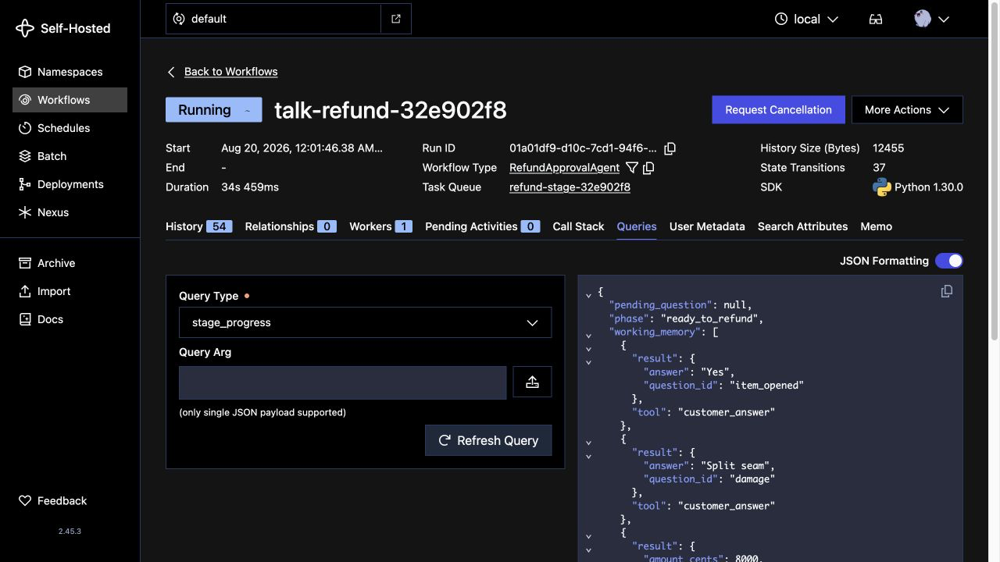

# Watch it in Temporal Web

Back to the [README](../README.md). This page covers starting your own dev
server (including the port variant), what to check at each frame, the CLI
commands, and resetting between takes.

## Start your own dev server

Start the Temporal dev server yourself before running the stage. The stage
reuses any server it can reach at `TEMPORAL_ADDRESS` (default
`localhost:7233`) and stops only the processes it started, so your server and
its Web UI stay up after the stage exits. If you let the stage start a server,
it uses `.demo-state/temporal.db` and shuts that server down when the stage
exits, which takes the UI with it.

```bash
# Terminal 1: in-memory dev server, with a fresh Workflow list each time
temporal server start-dev
# Web UI: http://localhost:8233

# Terminal 2: give the run a name you can find in the UI
uv run refund-demo stage --workflow-id nyghtowl-take-01
```

If another server already holds the default ports, run this demo's server on
other ports and point the stage at it. The stage then connects to that server
instead of starting its own:

```bash
lsof -nP -iTCP:7233 -iTCP:8233 -sTCP:LISTEN   # who holds the default ports?

# Terminal 1
temporal server start-dev --port 7243 --ui-port 8243
# Web UI: http://localhost:8243

# Terminal 2
TEMPORAL_ADDRESS=localhost:7243 TEMPORAL_NAMESPACE=default \
  uv run refund-demo stage --workflow-id nyghtowl-take-01
```

Check `TEMPORAL_ADDRESS` in `.env` too: if it names a remote server that
answers, the stage uses that server. Never press Ctrl+C on a server someone else
is using.

## What to check at each frame

The stage screens don't print the Workflow ID. Without `--workflow-id`, the ID
is `talk-refund-<token>`, where `<token>` matches the `stage-<token>` folder in
the `Stage logs:` line printed at the end. The Workflow type is
`RefundApprovalAgent`.

1. At `Press Enter to submit the refund`, open the
   Workflow, go to the Queries tab, and run `stage_progress`. It returns
   `phase: "ready_to_refund"`, two `customer_answer` entries (with the default
   answers, `item_opened`: `Yes` and `damage`: `Split seam`), and the
   `lookup_order` and `lookup_customer_history` results.
2. After the kill (`WORKER GONE`), use the History tab. The Workflow is still
   `Running`. It shows two `WorkflowExecutionSignaled` (`customer_answer`)
   events, the completed `agent_decide_next_step`, `lookup_order`, and
   `lookup_customer_history` Activities, no `issue_refund`, and no pending
   Activities. Each Activity row carries a plain-words summary:
   `Agent turn 1: decide the next step` for each model turn,
   `Look up order 1234`, `Look up the customer's refund history`,
   `Check the refund policy`, and, after recovery,
   `Issue the refund in Stripe` (offline too, where the ledger stands in for
   Stripe). This is the same history the stage's
   `WORKER GONE` pane reads. Don't run a Query now: Queries need a live Worker.
3. After recovery, the Workflow is `Completed`. No `agent_decide_next_step`,
   lookup, or `customer_answer` event repeats, because the new Worker replayed
   them from history. The new application-level work is the `release` Signal
   and one `issue_refund` Activity at attempt 1, alongside the usual Workflow
   Task events. The result's `idempotency_key` is
   `durable-refund-<sha256 of workflow_id:run_id>`. That `ActivityTaskStarted`
   event's identity is the new Worker's `<pid>@refund-demo`, with a different
   PID from the first Worker's earlier `WorkflowTaskStarted` events. While the
   stage's last frame is up, a `stage_progress` Query returns
   `phase: "completed"`.

Every client the demo starts reports `<pid>@refund-demo` instead of the SDK
default `<pid>@<hostname>`, so the machine's hostname never appears on the
Workers tab or in event identities. Set `TEMPORAL_IDENTITY` to replace it; that
value is used verbatim, so a Worker restart no longer shows a new PID.

The Workflow's summary also shows its history size, which
[When Event History grows](HISTORY_GROWTH.md) uses.



These CLI commands work even when no Worker is running (add
`--address localhost:7243` for the port variant):

```bash
temporal workflow describe --workflow-id nyghtowl-take-01
temporal workflow show --workflow-id nyghtowl-take-01
```

## Two owners on the durable side

The durable side has two owners:

- **Temporal** owns the Activity attempt and execution progress.
- **Stripe** owns whether the refund committed.

Stripe's paid charge is not a record of the agent's answers or the loop's
execution position. Temporal records the application work and supplies the
recovery point. At the later uncertain-effect boundary, the shared identity
also lets a retry reconcile with Stripe rather than infer the result from
memory.

## Reset between takes

You don't have to do anything between default takes. Every stage run gets a
fresh token, so it uses a new Workflow ID (unless you pass `--workflow-id`), a
private task queue `refund-stage-<token>`, and its own state directory
`.demo-state/stage-<token>/`. Use a new `--workflow-id` for every take.
Reusing one while an earlier take is still Running fails with
`WorkflowAlreadyStartedError`.

| After | Run |
| --- | --- |
| A `--real` take that ended before the durable refund | `uv run refund-demo cleanup`. It refunds only outstanding demo test payments; Stripe keeps its records. |
| An aborted take that left a Running Workflow | `uv run refund-demo stop <workflow-id>` |
| The stage process was killed hard | `pgrep -fl refund_agent` lists stray stage processes (`python -m refund_agent.worker` or `python -m refund_agent.naive_refund`). Check each command line, then stop only those. |
| You want an empty Temporal Web list | Press Ctrl+C on your own in-memory `temporal server start-dev`, then start it again. Never do this to a server someone else is using. |
| You want to clear local files | Stop any dev server that uses `.demo-state/temporal.db`, then run `rm -rf .demo-state`. This removes stage logs, token logs (`model-usage.jsonl`), offline ledgers, and the stage-started server's database. |
